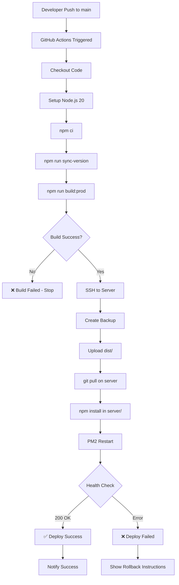
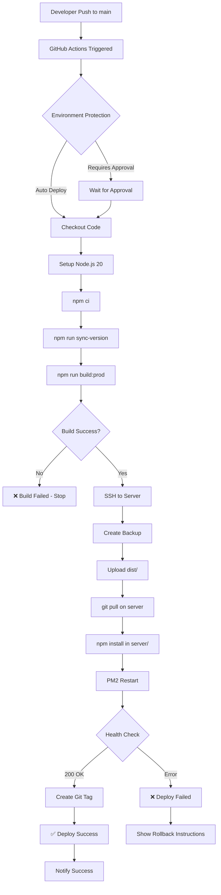
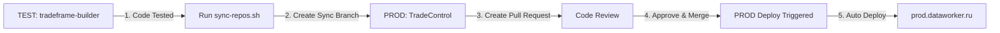
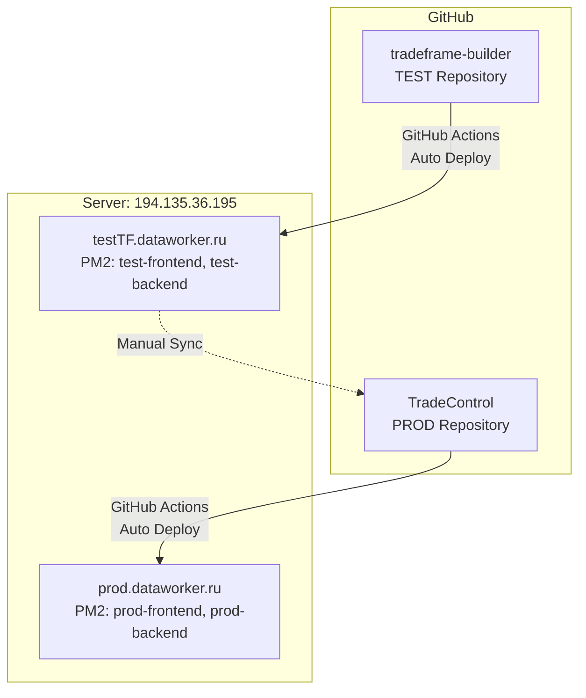
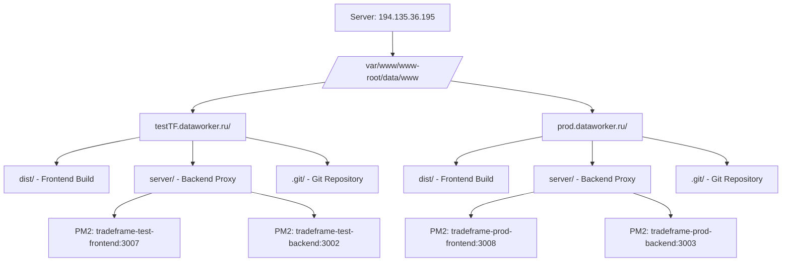
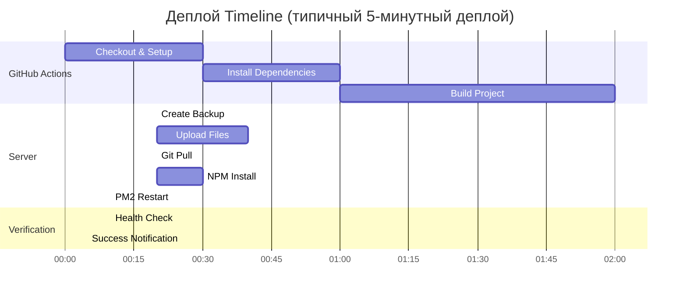
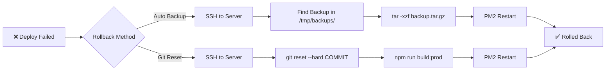
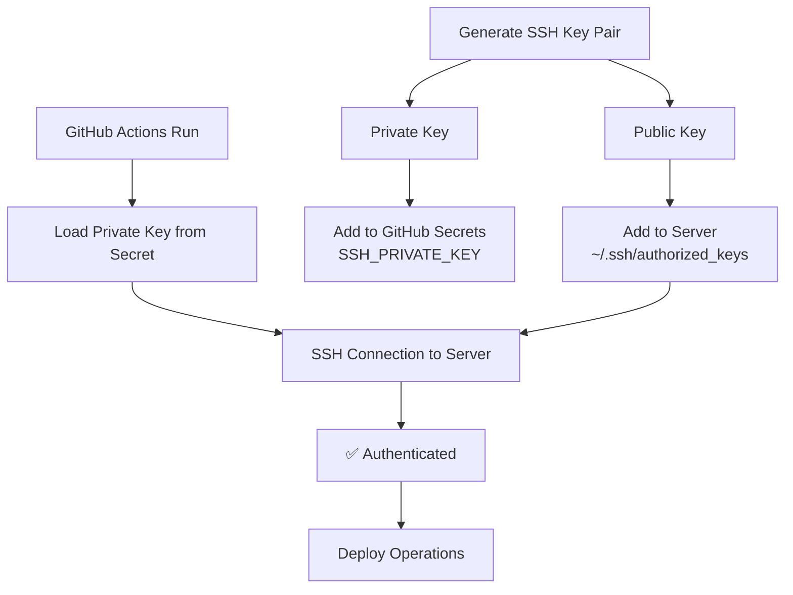

# 🔄 Диаграмма процесса деплоя

## Workflow: TEST Environment

## Workflow: PRODUCTION Environment

## Процесс синхронизации TEST → PROD

## Архитектура репозиториев

## Структура деплоя на сервере

## Timeline типичного деплоя

## Rollback процесс

## Security: SSH Key Flow

---

## 📊 Статистика деплоя

**Средние показатели:**

- ⏱️ **Время деплоя TEST**: 3-5 минут
- ⏱️ **Время деплоя PROD**: 4-6 минут (с health checks)
- 💾 **Размер сборки**: ~1.2 MB (gzipped)
- 📦 **Количество файлов**: ~50-100 файлов в dist/
- 🔄 **Downtime**: ~5-10 секунд (время перезапуска PM2)

**Бэкапы:**

- 📁 Хранятся в `/tmp/backups/`
- 📦 Средний размер: 2-5 MB
- 🗑️ Автоочистка: при перезагрузке сервера (`/tmp` очищается)
- 💡 Рекомендация: настроить регулярное копирование в постоянное хранилище

---

## 🎯 Best Practices

1. **Всегда тестируйте в TEST** перед деплоем в PROD
2. **Code Review** для всех изменений перед merge
3. **Создавайте git tags** для версионирования
4. **Мониторьте логи** после каждого деплоя
5. **Сохраняйте бэкапы** в безопасное место
6. **Документируйте изменения** в CHANGELOG.md
