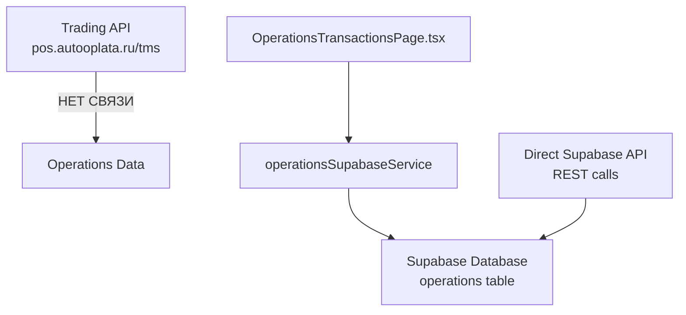

# 📊 Анализ потока данных операций от торгового API к приложению

## 🔍 Текущая архитектура

### 1. **ОТСУТСТВУЕТ прямая связь с торговым API для операций**

**Ключевая находка**: Операции в приложении **НЕ загружаются** из торгового API `pos.autooplata.ru/tms`. Это отдельный поток данных.



### 2. **Реальная цепочка загрузки операций**

#### **Фронтенд (UI Layer)**
- `src/pages/OperationsTransactionsPage.tsx` - отображает операции
- Использует: `operationsSupabaseService.getOperations()` напрямую

#### **Service Layer**
- `src/services/operationsSupabaseService.ts` - ОСНОВНОЙ сервис
- `src/services/operationsService.ts` - обертка/роутер между mock/API/Supabase

#### **Data Layer**
- **Supabase Database**: `operations` table
- **Прямые REST вызовы** к Supabase API
- **Fallback на hardcoded данные** при ошибках

### 3. **Подробная схема потока данных**

```
🎯 UI Component (OperationsTransactionsPage.tsx)
    ↓ useEffect() на строке 65
    ↓ calls: operationsSupabaseService.getOperations({})
    
🔧 Service Layer (operationsSupabaseService.ts)
    ↓ Method: getOperations() на строке 54
    ↓ Tries: supabaseConfigManager.getConnectionInfo()
    ↓ IF configured → uses getOperationsViaConfig()
    ↓ ELSE → uses direct hardcoded Supabase connection
    
🗄️ Data Source Options:
    Option A: Configured Supabase (via supabaseConfigManager)
              ↓ fetchFromSupabase(endpoint)
              
    Option B: Direct Supabase API (hardcoded credentials)
              ↓ fetch(supabaseUrl/rest/v1/operations)
              ↓ Auth: Bearer service_role_key
              
    Option C: Fallback - throws error if both fail
    
📊 Data Processing:
    ↓ Raw Supabase data (SupabaseOperation format)
    ↓ transformSupabaseToOperation() на строке 316
    ↓ Returns: Operation[] (app format)
    
🖥️ UI Rendering:
    ↓ filteredOperations (useMemo с фильтрацией)
    ↓ KPI calculations (operationKpis, fuelKpis, paymentKpis)
    ↓ Table/Card rendering based on isMobile
```

### 4. **Жестко заданные конфигурации**

#### **Supabase Connection** (строки 81-82):
```typescript
const supabaseUrl = 'https://tohtryzyffcebtyvkxwh.supabase.co';
const serviceKey = 'eyJhbGciOiJIUzI1NiIsInR5cCI6IkpXVCJ9...';
```

#### **API Endpoint** (строка 84):
```typescript
let endpoint = `${supabaseUrl}/rest/v1/operations?select=*&order=start_time.desc`;
```

### 5. **Маппинг данных (transformSupabaseToOperation)**

```typescript
// Supabase Format → App Format
{
  id: data.id,
  operationType: data.operation_type,  // snake_case → camelCase
  status: data.status,
  startTime: data.start_time,          // snake_case → camelCase
  tradingPointId: data.trading_point_id,
  fuelType: data.fuel_type,
  totalCost: data.total_cost,
  paymentMethod: data.payment_method,
  // ... etc
}
```

## 🚫 Что НЕ используется для операций

### **Trading Network API НЕ участвует в операциях**
- `tradingNetworkAPI.ts` - используется ТОЛЬКО для цен и справочников
- Методы `getPrices()`, `getServices()` - НЕ для операций
- `pos.autooplata.ru/tms` - НЕ источник транзакций

### **Операции НЕ создаются автоматически**
- Нет синхронизации транзакций из торгового API
- Нет автоматического создания операций при продажах
- Нет real-time потока от POS-терминалов

## ⚠️ Проблемные места

### 1. **Хардкод конфигурации**
```typescript
// Строки 81-82 - хардкод URL и ключа
const supabaseUrl = 'https://tohtryzyffcebtyvkxwh.supabase.co';
const serviceKey = 'eyJhbGciOiJIUzI1NiIsInR5cCI6IkpXVCJ9...';
```

### 2. **Отсутствие связи с торговым API**
- Операции существуют изолированно от продаж
- Нет синхронизации с real-time данными АЗС
- Демо-данные не отражают реальные транзакции

### 3. **Сложная логика fallback**
```typescript
// Сначала пытается получить конфигурацию
// Потом fallback на хардкод
// При ошибке - throw error
```

## 💡 Возможные улучшения

### 1. **Интеграция с торговым API**
```typescript
// Новый сервис для синхронизации
class TradingOperationsSyncService {
  async syncTransactionsFromTradingAPI() {
    // Получить транзакции из pos.autooplata.ru
    // Преобразовать в формат операций
    // Сохранить в Supabase operations table
  }
}
```

### 2. **Real-time обновления**
```typescript
// WebSocket подключение к торговому API
// Автоматическое создание операций при продажах
// Обновление статусов в реальном времени
```

### 3. **Централизованная конфигурация**
```typescript
// Убрать хардкод, использовать настройки из supabaseConfigManager
// Единая точка конфигурации для всех подключений
```

## 📋 Ключевые файлы

| Файл | Роль | Важность |
|------|------|----------|
| `src/pages/OperationsTransactionsPage.tsx` | UI компонент | 🔴 Критично |
| `src/services/operationsSupabaseService.ts` | Основная бизнес-логика | 🔴 Критично |
| `src/services/operationsService.ts` | Роутер между источниками | 🟡 Важно |
| `src/services/tradingNetworkAPI.ts` | НЕ используется для операций | 🟢 Не связано |

## 🎯 Заключение

**Операции и торговый API - ЭТО РАЗНЫЕ СИСТЕМЫ!**

- Торговый API (`pos.autooplata.ru/tms`) = Цены, справочники, состояние оборудования
- Операции (`operations` table) = Транзакции, продажи, отчетность

Для полной интеграции нужно создать мост между системами через новый синхронизационный сервис.