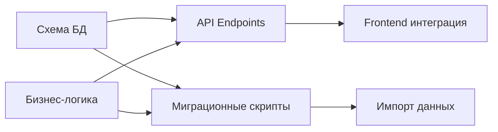

# 🚀 ПЛАН ПАРАЛЛЕЛЬНОЙ МИГРАЦИИ - РАСПРЕДЕЛЕНИЕ ПО АГЕНТАМ

## СТАРТ: 3 ПАРАЛЛЕЛЬНЫХ ПОТОКА РАБОТЫ

### 🟢 АГЕНТ 1: ИНФРАСТРУКТУРА И БД
**Приоритет:** Критический  
**Время:** 1 неделя

#### День 1-2: База данных
```bash
# Задачи:
1. ✅ Применить schema.sql к тестовой БД
2. ✅ Применить schema-additional.sql
3. ✅ Настроить Supabase проект
4. ✅ Создать тестовые connection strings
5. ✅ Проверить все триггеры и индексы
```

#### День 3-4: Аутентификация
```typescript
// Создать:
- src/api/auth/jwt.ts - JWT middleware
- src/api/auth/refresh.ts - Refresh tokens
- src/api/auth/password.ts - Bcrypt хеширование
- migrations/001_migrate_users.ts
```

#### День 5: Инфраструктура API
```typescript
// Настроить:
- Express/Fastify сервер
- CORS политики
- Rate limiting
- API версионирование
- Swagger документация
```

**Deliverables:**
- ✅ Работающая БД с полной схемой
- ✅ JWT аутентификация
- ✅ Базовый API сервер

---

### 🔵 АГЕНТ 2: БИЗНЕС-ЛОГИКА И СЕРВИСЫ
**Приоритет:** Высокий  
**Время:** 1 неделя

#### День 1-2: Извлечение бизнес-логики
```typescript
// Создать файлы:
1. src/services/tanksBusinessLogic.ts
   - Синхронизация с оборудованием
   - Расчеты уровней
   - Правила безопасности

2. src/services/rolesBusinessLogic.ts  
   - Наследование permissions
   - Проверка доступа по скоупам
   - RBAC правила

3. src/services/shiftReportsBusinessLogic.ts
   - Финансовые расчеты
   - Сверка смен
   - Генерация отчетов
```

#### День 3-4: Миграционные скрипты
```typescript
// migrations/
- 002_export_mock_data.ts - Экспорт всех mock данных в JSON
- 003_transform_data.ts - Трансформация структур
- 004_import_networks.ts - Импорт networks
- 005_import_users.ts - Импорт users
- 006_import_operations.ts - Импорт 250+ операций
```

#### День 5: Валидация данных
```typescript
// Создать:
- src/validators/operations.ts
- src/validators/prices.ts  
- src/validators/tanks.ts
- tests/business-logic/
```

**Deliverables:**
- ✅ 3 файла бизнес-логики
- ✅ 6 миграционных скриптов
- ✅ Валидаторы для всех сущностей

---

### 🟡 АГЕНТ 3: API ENDPOINTS И ИНТЕГРАЦИЯ
**Приоритет:** Высокий  
**Время:** 1 неделя

#### День 1: Простые CRUD endpoints
```typescript
// src/api/routes/
1. networks.ts - GET, POST, PUT, DELETE /api/v1/networks
2. fuel-types.ts - CRUD для nomenclature
3. equipment-types.ts - CRUD для типов оборудования
```

#### День 2-3: Сложные endpoints
```typescript
4. users.ts - С проверкой прав
5. roles.ts - С наследованием
6. operations.ts - С транзакциями
7. prices.ts - С историей и пакетами
```

#### День 4-5: Интеграция с frontend
```typescript
// Обновить сервисы:
1. networksService.ts -> использовать реальный API
2. nomenclatureService.ts -> переключить на API
3. Настроить apiSwitch.ts для тестирования
4. Добавить error handling
```

**Deliverables:**
- ✅ 7+ REST API endpoints
- ✅ Swagger документация
- ✅ 3 сервиса переключены на API

---

## НЕДЕЛЯ 2: РАСШИРЕНИЕ И ТЕСТИРОВАНИЕ

### 🟢 АГЕНТ 1: REAL-TIME И WEBSOCKETS
```typescript
- WebSocket сервер для tank monitoring
- Server-sent events для цен
- Push notifications setup
- Redis для кеширования
```

### 🔵 АГЕНТ 2: СЛОЖНЫЕ МИГРАЦИИ
```typescript
- Миграция Operations (250+ записей)
- Миграция Price History (1500+ записей)
- Миграция Tanks с связями
- Time-series для fuel stocks
```

### 🟡 АГЕНТ 3: UI ИНТЕГРАЦИЯ
```typescript
- Переключить все простые страницы на API
- Обновить Equipment страницу
- Интегрировать real-time обновления
- Настроить error boundaries
```

---

## 📋 НЕМЕДЛЕННЫЕ ДЕЙСТВИЯ (СЕГОДНЯ)

### Шаг 1: Подготовка окружения (30 минут)
```bash
# 1. Создать ветку для миграции
git checkout -b feature/database-migration

# 2. Создать директории
mkdir -p src/api/routes
mkdir -p src/api/auth  
mkdir -p src/validators
mkdir -p migrations
mkdir -p tests/api
mkdir -p tests/business-logic

# 3. Установить зависимости
npm install bcryptjs jsonwebtoken express cors helmet
npm install --save-dev @types/bcryptjs @types/jsonwebtoken
```

### Шаг 2: Запустить 3 параллельных задачи

#### 📝 Задача 1: Применить схему к БД
```sql
-- В Supabase SQL Editor:
-- 1. Выполнить schema.sql
-- 2. Выполнить schema-additional.sql
-- 3. Проверить создание таблиц
```

#### 📝 Задача 2: Создать первый миграционный скрипт
```typescript
// migrations/001_export_networks.ts
import { networksService } from '../src/services/networksService';

export async function exportNetworks() {
  const networks = await networksService.getNetworks();
  // Сохранить в JSON для импорта
  fs.writeFileSync('data/networks.json', JSON.stringify(networks));
}
```

#### 📝 Задача 3: Создать первый API endpoint
```typescript
// src/api/routes/networks.ts
import { Router } from 'express';
const router = Router();

router.get('/networks', async (req, res) => {
  // Получить из БД
});

router.post('/networks', async (req, res) => {
  // Создать в БД
});
```

---

## 🎯 КПИ ПЕРВОЙ НЕДЕЛИ

### Минимальный результат:
- ✅ БД развернута и работает
- ✅ Networks полностью на реальном API
- ✅ 3 файла бизнес-логики созданы
- ✅ JWT аутентификация работает

### Целевой результат:
- ✅ 5+ сервисов переключены на API
- ✅ Все mock данные экспортированы
- ✅ 10+ API endpoints работают
- ✅ Начальные данные импортированы в БД

### Отличный результат:
- ✅ 10+ сервисов на реальном API
- ✅ WebSocket для real-time готов
- ✅ Все простые CRUD работают
- ✅ UI не отличается от mock версии

---

## 🔄 СИНХРОНИЗАЦИЯ АГЕНТОВ

### Ежедневный standup (15 мин):
1. Что сделано вчера
2. Что планируется сегодня  
3. Какие блокеры
4. Нужна ли помощь других агентов

### Точки синхронизации:
- **День 2:** Схема БД финализирована
- **День 3:** Первый сервис на API
- **День 5:** Демо работающей системы

### Критические зависимости:


---

## ⚡ QUICK START КОМАНДЫ

```bash
# Агент 1: Запустить БД
npm run db:migrate
npm run db:seed

# Агент 2: Экспорт данных
npm run migrate:export
npm run migrate:transform

# Агент 3: Запустить API
npm run api:dev
npm run api:docs

# Все агенты: Тестирование
npm run test:api
npm run test:integration
```

---

## 📊 МЕТРИКИ ПРОГРЕССА

```yaml
День 1:
  - Схема БД: [████████████████████] 100%
  - Networks API: [████░░░░░░░░░░░░░░░░] 20%
  - Бизнес-логика: [████░░░░░░░░░░░░░░░░] 20%

День 3:
  - Схема БД: [████████████████████] 100%
  - Networks API: [████████████████████] 100%
  - Бизнес-логика: [████████████░░░░░░░░] 60%
  - Миграция данных: [████████░░░░░░░░░░░░] 40%

День 5:
  - Простые CRUD: [████████████████████] 100%
  - Сложные API: [████████████░░░░░░░░] 60%
  - Frontend интеграция: [████████░░░░░░░░░░░░] 40%
  - Тестирование: [████████████░░░░░░░░] 60%
```

---

**Готовы начать? Выберите роль агента или запустите все 3 параллельно!**