# ТСО — Терминал самообслуживания
## Руководство для менеджеров и операторов АЗС

---

## Содержание

1. [Что такое ТСО?](#1-что-такое-тсо)
2. [Экосистема TradeSuite](#2-экосистема-tradesuite)
3. [Варианты применения](#3-варианты-применения)
4. [Инструкция по использованию терминала](#4-инструкция-по-использованию-терминала-оплаты-на-азс)
5. [Экраны терминала](#5-экраны-терминала)
6. [Сервисное меню (для персонала)](#6-сервисное-меню-для-персонала)

---

## 1. Что такое ТСО?

**ТСО (Терминал самообслуживания)** — программно-аппаратный комплекс, который позволяет клиентам самостоятельно оплачивать топливо без помощи оператора. ТСО подключается к облачной платформе **TradeFrame** и может работать как дополнительный модуль к АЗС с оператором или как ядро автоматической АЗС (ААЗС).

### Преимущества для бизнеса

| Преимущество | Описание |
|--------------|----------|
| **Снижение очередей** | Клиенты не ждут оператора |
| **Работа 24/7** | Терминал работает круглосуточно без персонала |
| **Экономия на персонале** | Меньше операторов или полностью без них |
| **Контроль в реальном времени** | Все операции видны в облачной платформе TradeFrame |
| **Удалённое управление** | Контроль резервуаров и оборудования через TradeFrame |

### Способы оплаты на ТСО

- **Наличные** — оплата купюрами через купюроприёмник
- **Банковская карта** — Visa, MasterCard, МИР и другие
- **Топливная карта** — корпоративные и дисконтные карты
- **Онлайн-заказ** — оплата через мобильное приложение (заказ создаётся заранее, клиент только подтверждает на терминале)

### Оборудование ТСО

```
┌─────────────────────────────────────┐
│               ТСО                   │
├─────────────────────────────────────┤
│  Сенсорный экран                    │ ← Клиент нажимает на экран
│  Купюроприёмник                     │ ← Принимает наличные
│  Картридер                          │ ← Читает топливные карты
│  Банковский терминал                │ ← Принимает банковские карты
│  Принтер чеков                      │ ← Печатает чеки
└─────────────────────────────────────┘
```

---

## 2. Экосистема TradeSuite

**TradeSuite** — зонтичный бренд, объединяющий комплекс решений для топливного бизнеса.

### 2.1 Приложения экосистемы (Trade*)

| Приложение | Назначение |
|------------|------------|
| **TradeFrame** | Облачная платформа управления станциями |
| **TradeCorp** | Корпоративные топливные карты (B2B) |
| **TradeBonus** | Программа лояльности (B2C) |
| **TradeGate** | Интеграция с агрегаторами и онлайн-заказы |

### 2.2 Торговые точки TradeFrame

К платформе **TradeFrame** подключаются торговые точки разных типов:

| Код | Тип точки | Назначение |
|-----|-----------|------------|
| **АЗС** | **АЗС с оператором** | Классическая станция с персоналом |
| **ААЗС** | **Автоматическая АЗС** | Без персонала (включая контейнерные) |
| **АГЗС** | **АГЗС** | Газовая станция (пропан-бутан) |
| **ТСО** | **Терминал самообслуживания** | Модуль к АЗС или ядро ААЗС |

### 2.3 Схема архитектуры

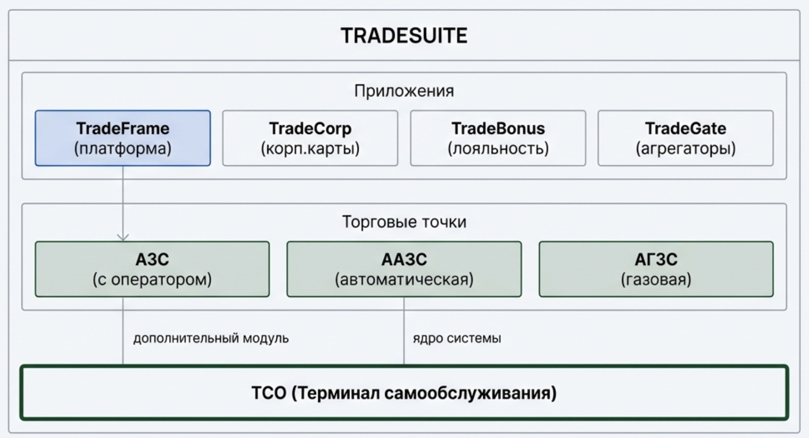
*Структура экосистемы TradeSuite*

### 2.4 Пример структуры сети

```
Сеть "Горизонт"
 ├── АЗС-001            АЗС "Центральная" (с оператором)
 ├── АЗС-002 + ТСО      АЗС "Северная" (с терминалом)
 ├── АГЗС-001           АГЗС "Газовая-1"
 ├── ААЗС-001           Автоматическая АЗС "Автомат-1"
 └── ААЗС-002           Автоматическая АЗС "Автомат-2"
```

## 3. Варианты применения

ТСО может использоваться в двух конфигурациях:

### 3.1 ААЗС — Автоматическая АЗС

**Полностью автоматическая станция без оператора**

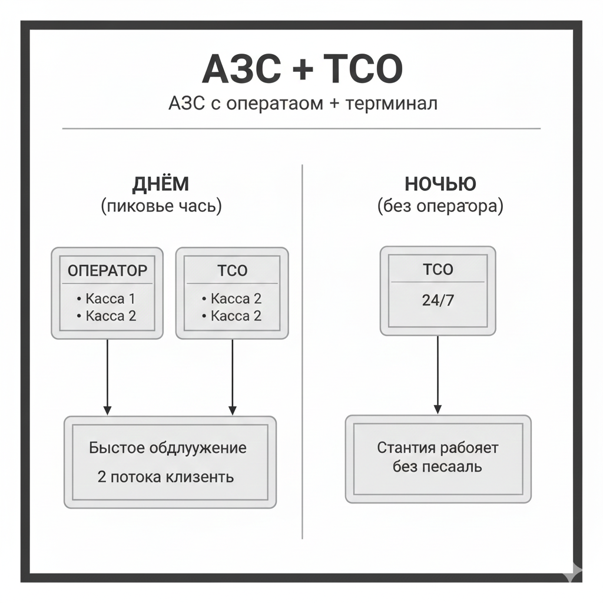
*Схема работы автоматической АЗС: ТСО управляет всей станцией*

**Особенности ААЗС:**

| Функция | Описание |
|---------|----------|
| **Полная автономность** | Станция работает без персонала 24/7 |
| **Контроль резервуаров** | Интеграция с уровнемерами для мониторинга остатков |
| **Удалённое управление** | Все данные передаются в TradeFrame |
| **Автоматические уведомления** | Оповещения о низком уровне топлива, неисправностях |
| **Экономичность** | Минимальные затраты на эксплуатацию |

**Идеально подходит для:**
- Удалённых локаций (карьеры, стройплощадки, склады)
- Корпоративных заправок для автопарка
- Небольших населённых пунктов
- Придорожных станций с низким трафиком

---

### 3.2 АЗС + ТСО — Терминал на АЗС с оператором

**ТСО как дополнительный модуль к АЗС с оператором**

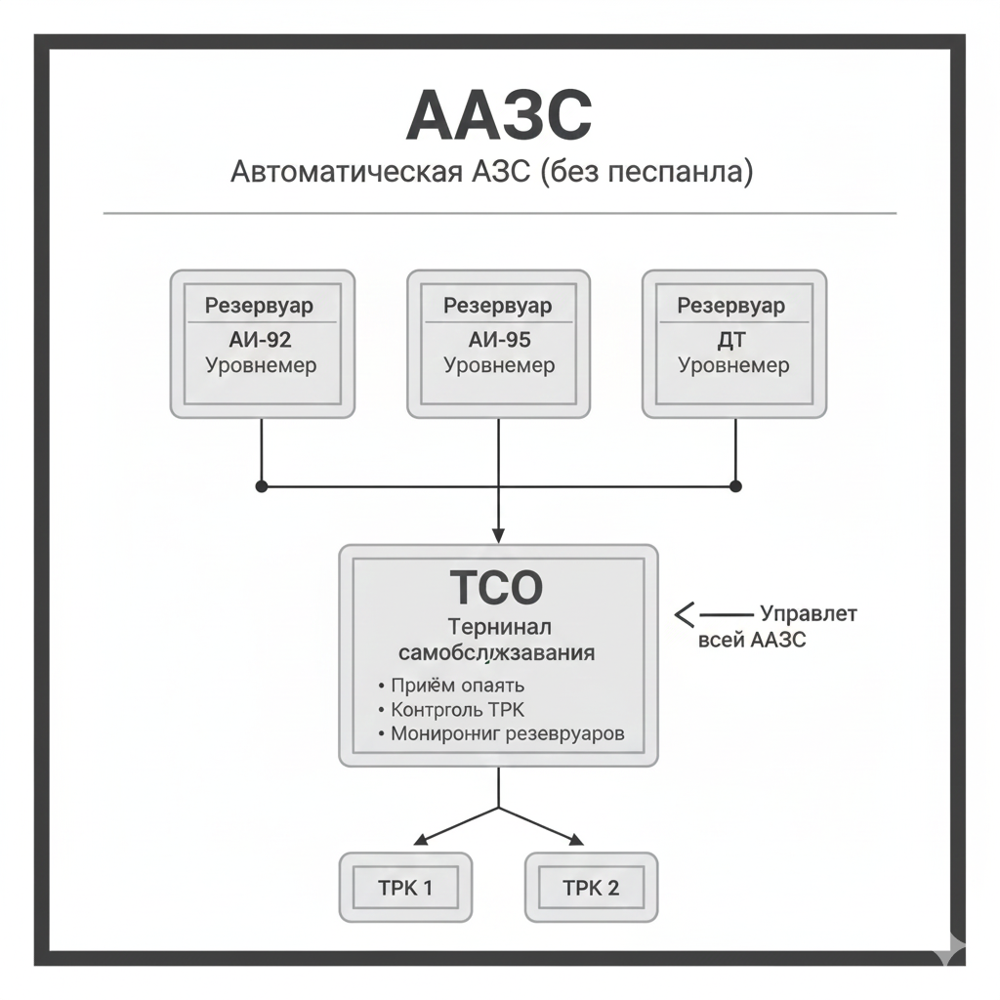
*Днём — два потока клиентов, ночью — станция работает без персонала*

**Режимы работы:**

| Время | Режим работы | Описание |
|-------|--------------|----------|
| **День** | Параллельно с оператором | Ускорение обслуживания, 2 точки продаж |
| **Ночь** | Самостоятельно | Станция работает без персонала |
| **Праздники** | Самостоятельно | Не нужно выводить оператора |

**Преимущества АЗС + ТСО:**

| Преимущество | Описание |
|--------------|----------|
| **Ускорение обслуживания** | Два потока клиентов одновременно |
| **Круглосуточная работа** | Ночью станция работает без оператора |
| **Экономия на персонале** | Меньше ночных смен для операторов |
| **Гибкость** | Переключение режимов по расписанию |

### 3.3 Удалённое управление через TradeFrame

TradeFrame предоставляет широкие возможности для удаленного администрирования:

| Функция | Описание |
|---------|----------|
| **Управление питанием** | Удаленная перезагрузка станции и терминала |
| **Ценообразование** | Централизованная установка и изменение цен на топливо |
| **Оповещения** | Гибкая настройка параметров уведомлений (Telegram, Email, SMS) |
| **Мониторинг состояния** | Контроль работоспособности терминала и всех узлов (принтер, купюроприемник и др.) |
| **Автокалибровка** | Автоматическая калибровка резервуаров на основе данных проливов |
| **Анализ запасов** | Сверка книжных остатков с фактическими замерами уровнемеров |
| **Отчетность** | Формирование и отправка сменных отчетов |

---

## 4. Инструкция по использованию терминала оплаты на АЗС

Терминал ТСО позволяет быстро и удобно оплатить топливо. Следуйте простым шагам ниже.

### Навигация по меню

- Навигация осуществляется с помощью выбора пункта меню и кнопок **«Далее»** и **«Назад»**
- На любом этапе оформления заказа можно вернуться назад и изменить выбор
- **Исключение:** после внесения наличных вернуться назад нельзя
- **Автоматическая отмена:** заказ автоматически отменяется через 5 минут бездействия
- **Автоподтверждение:** после завершения заказа экран автоматически подтверждается через 30 секунд

---

### Способ 1: Оплата наличными

**Быстрый способ:** Достаточно вставить купюру прямо на главном экране — терминал автоматически перейдёт к оформлению.

**Стандартный способ:**

1. На главном экране выберите **«Наличные и купоны»** → **«Наличные»**

2. **Внесите купюры**

   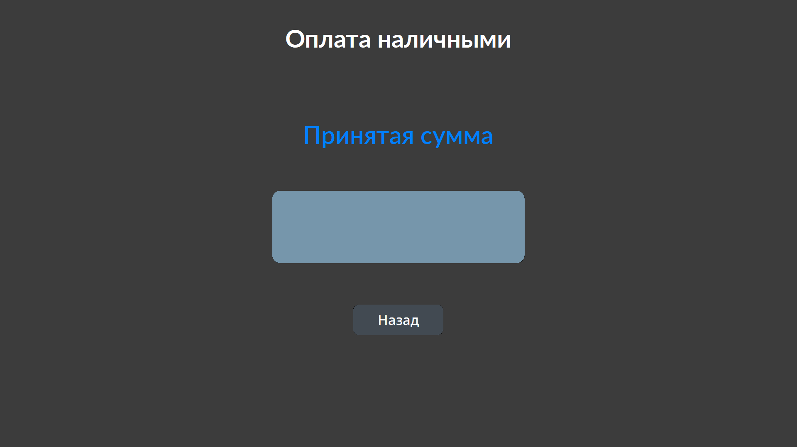

   После внесения всех купюр нажмите кнопку **«Далее»**

3. **Снимите пистолет с нужной ТРК**

   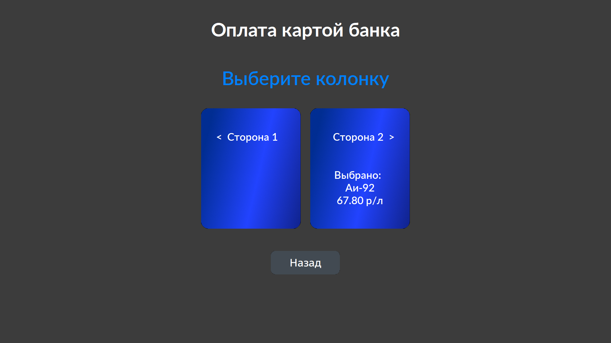

   Колонка выбирается автоматически при снятии пистолета. Убедитесь, что на экране отображается нужное топливо и цена.

   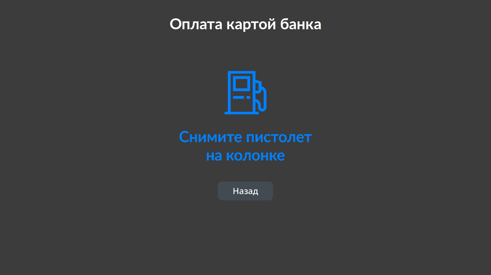

   > Если пистолет ещё не снят, терминал напомнит снять его с выбранной колонки

4. **Проверьте итоговую информацию**

   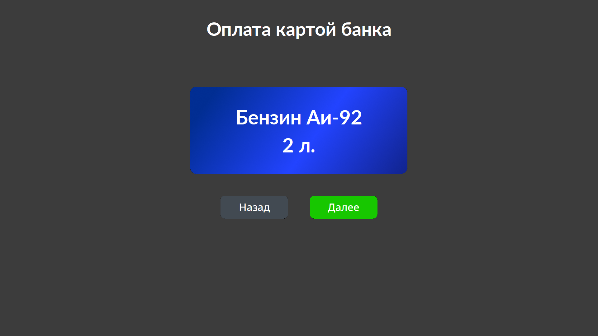

   Убедитесь, что всё выбрано правильно, и нажмите **«Далее»**

5. **Дождитесь печати чека**

   

6. **Заберите чек и заправляйтесь!**

   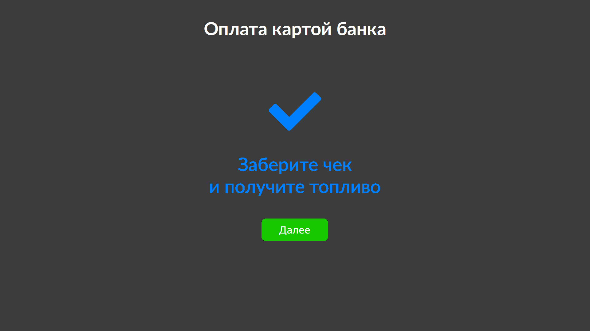

> **ВАЖНО! Сохраняйте чек!**
> Если вы заправили не весь оплаченный объём, на чеке будет напечатан **номер купона** на остаток. Используйте его для следующей заправки.

---

### Способ 2: Использование купона

Купон выдаётся, если при оплате наличными вы заправили меньше оплаченного объёма.

1. На главном экране выберите **«Наличные и купоны»** → **«Купон»**

2. **Введите номер купона**

   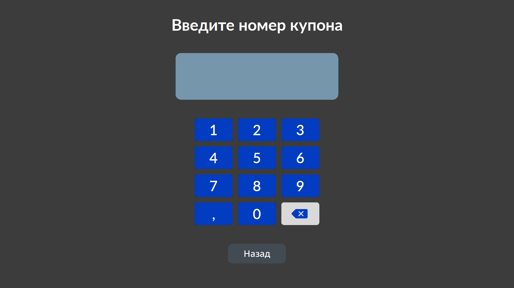

   Введите номер купона, указанный на вашем чеке

3. **Снимите пистолет с нужной ТРК** — колонка выберется автоматически. Убедитесь, что топливо соответствует купону.

4. **Подтвердите заказ** и заберите чек

> **Примечание:**
> - Если выбран другой тип топлива, терминал предложит снять правильный пистолет
> - Если по купону топливо не было получено ранее, к отпуску разрешено любое топливо

---

### Способ 3: Оплата банковской картой

1. На главном экране выберите **«Карта банка»**

2. **Выберите основание**

   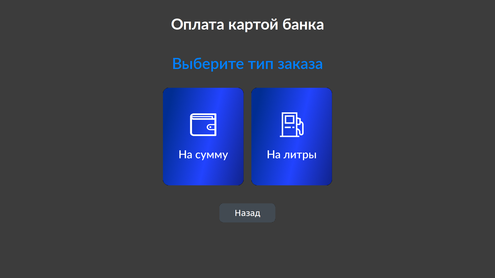

   - **На сумму** — заправка на определённую сумму
   - **На литры** — заправка определённого количества литров

3. **Введите сумму или литры**

   

   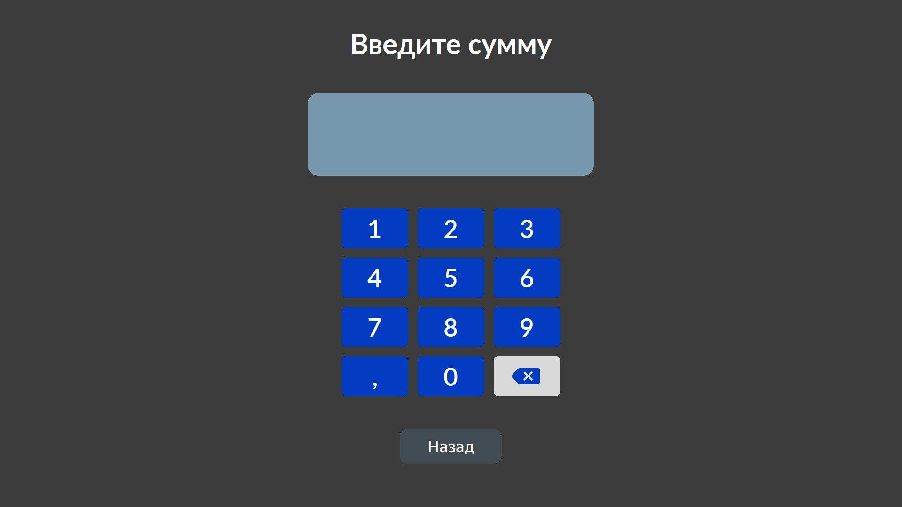

4. **Снимите пистолет с нужной ТРК** — колонка выберется автоматически. Проверьте информацию о топливе.

5. **Проверьте итоговую информацию** на экране подтверждения

6. **Приложите карту к терминалу банка**

   

   Дождитесь окончания обработки платежа

7. **Заберите чек и заправляйтесь!**

> **ВАЖНО!** Если в бак поместится меньше топлива, чем оплачено, разница будет автоматически возвращена на карту.

---

### Способ 4: Оплата топливной корпоративной картой

Топливные карты выдаются организациям для безналичной заправки служебного транспорта. Карта привязана к корпоративному счёту компании.

1. На главном экране выберите **«Топливная карта»**

2. **Приложите карту к считывателю** терминала

3. **Выберите операцию**

   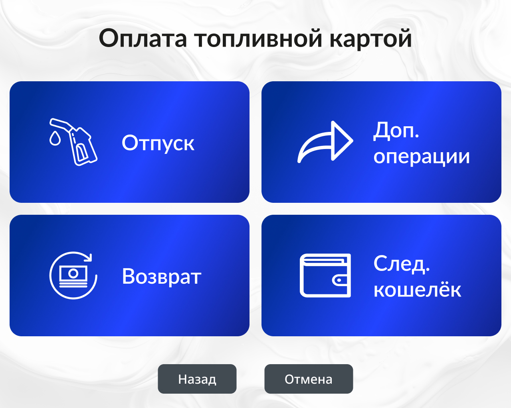

   - **Отпуск** — заправка топлива (основная операция)
   - **Возврат** — возврат средств на карту (если заправили меньше)
   - **Доп. операции** — дополнительные сервисы
   - **След. кошелёк** — переключение между кошельками на карте (если их несколько)

4. **Снимите пистолет с нужной ТРК**

   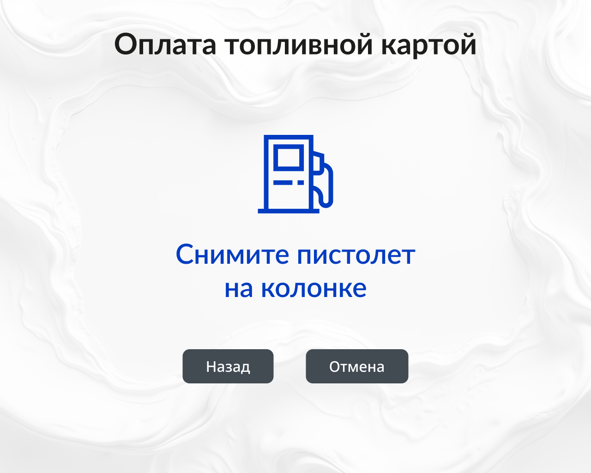

   Колонка выбирается автоматически при снятии пистолета.

5. **Проверьте итоговую информацию**

   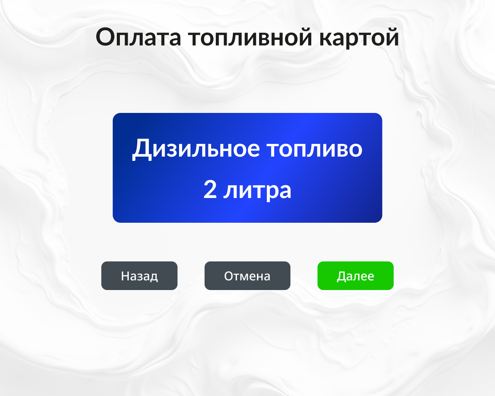

   Убедитесь, что отображается нужное топливо и объём, нажмите **«Далее»**

6. **Заберите чек и заправляйтесь!**

> **Особенности топливных карт:**
> - Лимиты на заправку устанавливаются работодателем
> - Доступные виды топлива могут быть ограничены
> - Все операции фиксируются и доступны в отчётах компании
> - При недостатке средств на счёте терминал сообщит об этом

---

## 5. Экраны терминала

### 5.1 Главный экран — Выбор типа оплаты

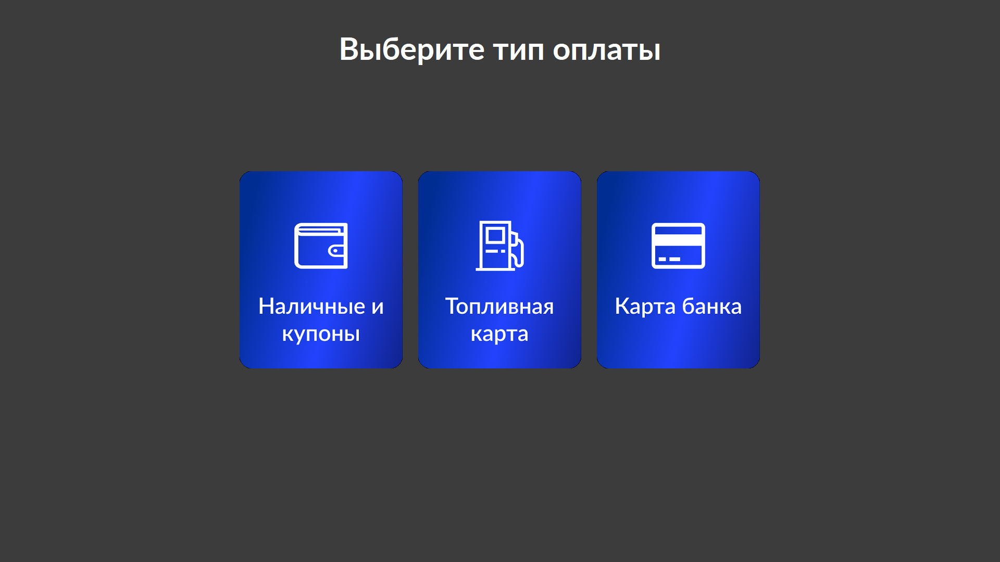

**Варианты выбора:**

| Кнопка | Описание |
|--------|----------|
| **Наличные и купоны** | Оплата купюрами или использование купона |
| **Карта банка** | Visa, MasterCard, МИР и другие |
| **Топливная карта** | Корпоративные топливные карты (для организаций) |

---

### 5.2 Внесение наличных


- Текущая сумма внесённых денег обновляется автоматически
- Кнопка **«Назад»** — отменить и вернуть деньги *(до нажатия «Далее»)*
- Кнопка **«Далее»** — перейти к выбору ТРК

---

### 5.3 Ввод купона


Экран для ввода номера купона с чека.

---

### 5.4 Выбор основания (банковская карта)


| Кнопка | Описание |
|--------|----------|
| **На сумму** | Заправка на определённую сумму в рублях |
| **На литры** | Заправка определённого количества литров |

---

### 5.5 Ввод количества

**Ввод литров:**


**Ввод суммы:**


---

### 5.6 Выбор ТРК (колонки)


Клиент **снимает пистолет с нужной ТРК** — терминал автоматически определяет выбранную колонку.

На экране отображается информация о доступных ТРК:
- Номер колонки
- Тип топлива
- Цена за литр

> Выбор колонки происходит автоматически при снятии пистолета — ничего вводить или нажимать не нужно.

---

### 5.7 Снимите пистолет


Этот экран появляется, если пистолет ещё не снят с выбранной колонки.

---

### 5.8 Итоговый экран


Проверьте:
- Тип топлива
- Количество литров
- Сумму к оплате

---

### 5.9 Ожидание карты


Приложите банковскую карту, телефон или часы к терминалу банка.

---

### 5.10 Печать чека


Дождитесь печати чека.

---

### 5.11 Завершение операции


- Зелёная галочка — операция успешна
- Напоминание забрать чек и заправиться
- Экран автоматически закроется через 30 секунд

---

### 5.12 Меню топливной карты


После прикладывания топливной карты отображается меню операций:

| Кнопка | Описание |
|--------|----------|
| **Отпуск** | Основная операция — заправка топлива |
| **Возврат** | Возврат средств на карту (если заправили меньше) |
| **Доп. операции** | Дополнительные сервисы |
| **След. кошелёк** | Переключение между кошельками на карте |

---

### 5.13 Выбор колонки (топливная карта)


- Терминал просит снять пистолет с нужной колонки
- Колонка определяется автоматически при снятии пистолета

---

### 5.14 Подтверждение заказа (топливная карта)


- Отображается выбранное топливо и объём
- Кнопки: **Назад**, **Отмена**, **Далее**
- После подтверждения начинается отпуск топлива

---

## 6. Сервисное меню (для персонала)

### Вход в сервисное меню

Чтобы войти в сервисное меню, последовательно нажмите на углы экрана:

```
┌─────────────────────────────────────┐
│  1️⃣                            3️⃣   │
│  Верхний левый         Верхний      │
│                        правый       │
│                                     │
│                                     │
│                                     │
│  4️⃣                            2️⃣   │
│  Нижний левый          Нижний       │
│                        правый       │
└─────────────────────────────────────┘

Порядок: 1 → 2 → 3 → 4
```

### Ввод пароля

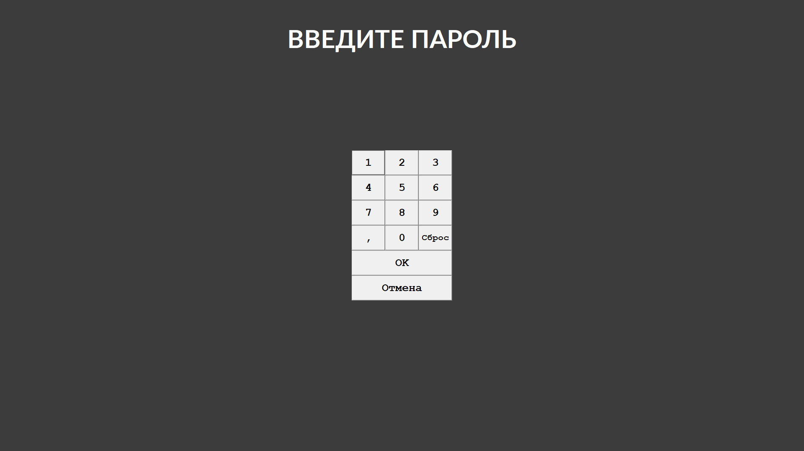

Введите пароль для доступа к сервисному меню.

---

### Главное сервисное меню

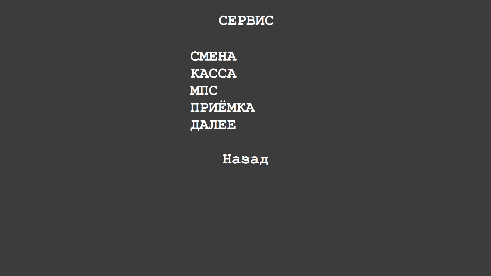

---

### Раздел «Смена»

| Функция | Описание |
|---------|----------|
| **Открытие/закрытие смены** | Управление сменой оператора |
| **Печать сменных отчетов** | Печать итогов за смену |
| **Печать промежуточных отчетов** | Отчёт без закрытия смены |
| **Инкассация** | Фиксация изъятия наличных |

---

### Раздел «Касса»

| Функция | Описание |
|---------|----------|
| **Х-отчет** | Промежуточный отчёт без обнуления |
| **Z-отчет** | Печать бумажного отчёта с обнулением |
| **Z-отчет (эл-ый)** | Печать отчёта в буфер |
| **Z-отчет (печать)** | Печать отчётов из буфера |
| **Открыть смену на кассе** | Открытие кассовой смены |

---

### Раздел «Приёмка»

Управление приёмкой топлива в резервуары.

| Функция | Описание |
|---------|----------|
| **Начать налив** | Фиксация текущего уровня топлива в резервуаре |
| **Закончить налив** | Фиксация конечного уровня и запись в таблицу остатков |
| **Ввод ТТН** | Ввод товарно-транспортной накладной |

**Варианты последовательности действий:**

1. `Ввод ТТН` → согласиться начать налив → `Закончить налив`
2. `Начать налив` → `Закончить налив` → `Ввод ТТН` (отказаться от начала)
3. `Начать налив` → `Ввод ТТН` (отказаться) → `Закончить налив`

> **Важно:**
> - Налив можно осуществлять только на **одном резервуаре** одновременно
> - Нельзя начать налив на другом резервуаре, не закончив предыдущий
> - ТТН можно вводить по нескольким резервуарам параллельно

---

### Раздел «МПС»

Операции с банковским терминалом:
- Сверка итогов
- Печать отчётов
- Диагностика связи

---

### Раздел «Прокачка»

**Технологический отпуск в мерник** — используется для проверки точности колонок.

---

### Раздел «Диагностика»

Диагностика терминала:
- Проверка связи с сервером
- Статус периферийного оборудования
- Журнал ошибок

---

### Раздел «Выключение»

| Функция | Описание |
|---------|----------|
| **Выключение терминала** | Полное выключение системы |
| **Перезагрузка терминала** | Перезапуск системы |

---

