# TradeFrame Builder
## Руководство пользователя платформы управления сетью АЗС

---

## Содержание

1. [Что такое TradeFrame Builder?](#1-что-такое-tradeframe-builder)
2. [Экосистема TradeSuite](#2-экосистема-tradesuite)
3. [Управление торговой сетью](#3-управление-торговой-сетью)
4. [Управление торговой точкой (АЗС)](#4-управление-торговой-точкой-азс)
5. [Система уведомлений](#5-система-уведомлений)
6. [Администрирование](#6-администрирование)
7. [Мобильная версия (PWA)](#7-мобильная-версия-pwa)

---

## 1. Что такое TradeFrame Builder?

**TradeFrame Builder** — это облачная платформа для централизованного управления сетью АЗС. Система объединяет все форматы топливного бизнеса в единое цифровое пространство: классические станции с операторами, автоматические терминалы самообслуживания и гибридные форматы.

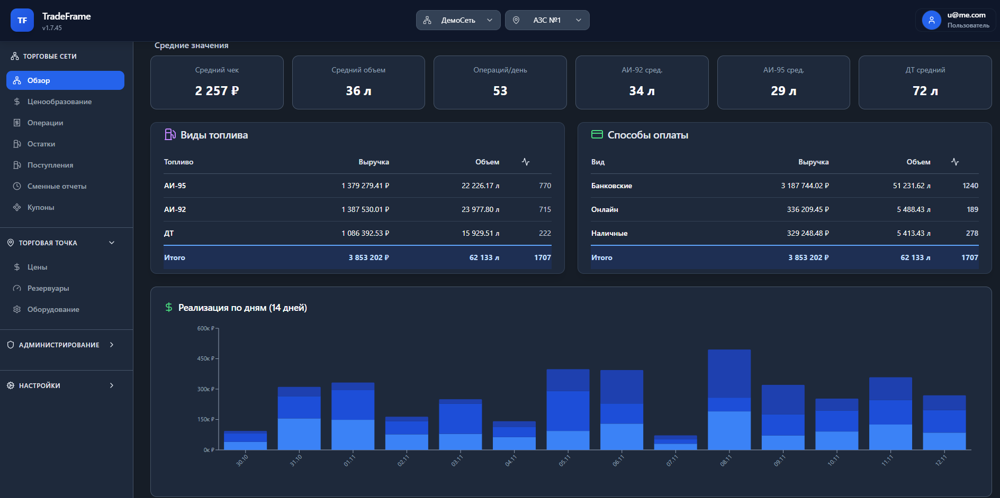
*Главный экран — обзор сети с ключевыми показателями*

### Что можно делать в TradeFrame

**Смотреть общую картину по сети**
- Сколько продали топлива сегодня / за неделю / за месяц
- Выручка по каждой станции
- Какое топливо продаётся лучше всего
- Сравнение станций между собой

**Анализировать продажи по способам оплаты**
- Наличные, банковские карты, онлайн-заказы
- Корпоративные карты, купоны
- Количество операций и сумма по каждому способу

**Следить за резервуарами**
- Уровень топлива в каждом резервуаре
- Температура и плотность
- Когда нужно заказывать поставку
- История поступлений (ТТН)

**Управлять ценами**
- Текущие цены на всех станциях в одной таблице
- Изменение цен на одной станции или сразу на всех
- Планирование изменения цен по расписанию

**Работать со сменными отчётами**
- Журнал всех смен
- Детали по каждой смене: продажи, поступления, остатки
- Показания счётчиков (ПСМ)
- Данные по резервуарам на начало и конец смены

**Контролировать оборудование**
- Статус всех ТРК (топливораздаточных колонок)
- Терминалы самообслуживания
- Купюроприёмники — уровень заполнения
- Когда нужна инкассация

**Получать уведомления**
- Telegram-бот присылает важные события
- Email-уведомления
- Настройка: что присылать и когда
- Режим «не беспокоить» на ночь

### Ключевые возможности

| Возможность | Описание |
|-------------|----------|
| **Единый интерфейс** | Управление всеми форматами АЗС из одного окна |
| **Данные в реальном времени** | Транзакции, остатки топлива, статусы оборудования |
| **Интеллектуальный учёт** | Автокалибровка резервуаров с учётом температуры и плотности |
| **Проактивные уведомления** | Telegram и Email оповещения о критических событиях |
| **Мобильный доступ** | PWA-приложение для работы с любого устройства |

### Для кого предназначена система

| Роль | Возможности |
|------|-------------|
| **Владелец/Директор** | Общая картина рентабельности, сравнение эффективности точек |
| **Менеджер сети** | Ценовая политика, логистика поставок, анализ продаж |
| **Менеджер АЗС** | Контроль оборудования, планирование ТО и инкассации |
| **Оператор** | Данные своей станции, уведомления о проблемах |
| **Бухгалтер** | Сменные отчёты, сверка остатков, интеграция с 1С |

---

## 2. Экосистема TradeSuite

**TradeSuite** — зонтичный бренд, объединяющий комплекс программных решений для автоматизации топливного бизнеса. Продукты экосистемы работают как единое целое, обеспечивая полный цикл управления — от приёма топлива до программ лояльности.

### Продукты экосистемы

*Структура экосистемы TradeSuite*

| Продукт | Назначение | Основные функции |
|---------|------------|------------------|
| **TradeFrame** | Управление сетью АЗС | Мониторинг продаж, резервуаров, оборудования. Ценообразование, сменные отчёты, аналитика |
| **TradeCorp** | Корпоративные клиенты | Топливные карты, лимиты, кредитные линии. Личный кабинет для организаций |
| **TradeBonus** | Программа лояльности | Накопление и списание бонусов. Акции, скидки, персональные предложения |
| **TradeGate** | Онлайн-заказы | Приём и обработка заказов от агрегаторов (Яндекс.Заправки, СберЗаправки и др.) |

**TradeFrame** — центральный продукт экосистемы. Именно в нём сходятся данные со всех станций сети: транзакции, остатки топлива, состояние оборудования. Остальные продукты расширяют возможности:

- **TradeCorp** добавляет работу с корпоративными клиентами — выпуск топливных карт, установка лимитов по объёму или сумме, ведение кредитных договоров
- **TradeBonus** реализует программы лояльности для розничных покупателей — начисление бонусов за покупки, проведение акций, персонализация предложений
- **TradeGate** обрабатывает онлайн-заказы от топливных агрегаторов — клиент оплачивает заправку в приложении (Яндекс.Заправки, СберЗаправки), заказ поступает на станцию, топливо отпускается без дополнительной оплаты

### Типы торговых точек

| Код | Тип точки | Назначение |
|-----|-----------|------------|
| **АЗС** | **АЗС с оператором** | Классическая станция с персоналом |
| **ААЗС** | **Автоматическая АЗС** | Без персонала (включая контейнерные) |
| **АГЗС** | **АГЗС** | Газовая станция (пропан-бутан) |
| **ТСО** | **Терминал самообслуживания** | Модуль к АЗС или ядро ААЗС |

> **Подробнее о терминалах самообслуживания:** см. [TERMINAL_TCO_GUIDE.md](TERMINAL_TCO_GUIDE.md)

---

## 3. Управление торговой сетью

### 3.1 Обзор сети

Дашборд с общей статистикой сети:

| Показатель | Описание |
|------------|----------|
| **KPI-карточки** | Выручка, объем продаж, количество транзакций, средний чек |
| **Карта сети** | Интерактивная карта с маркерами АЗС |
| **Статусы станций** | 🟢 Онлайн, 🟡 Внимание, 🔴 Критично |

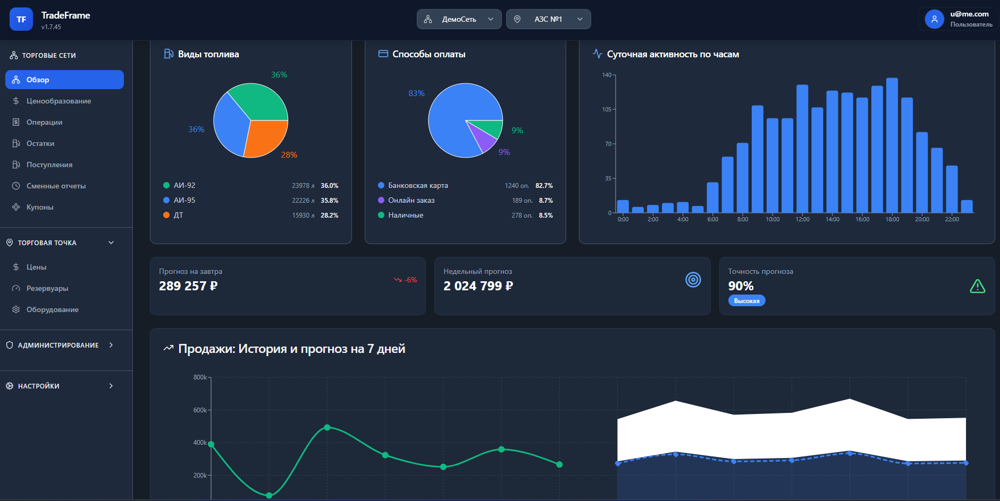

---

### 3.2 Ценообразование

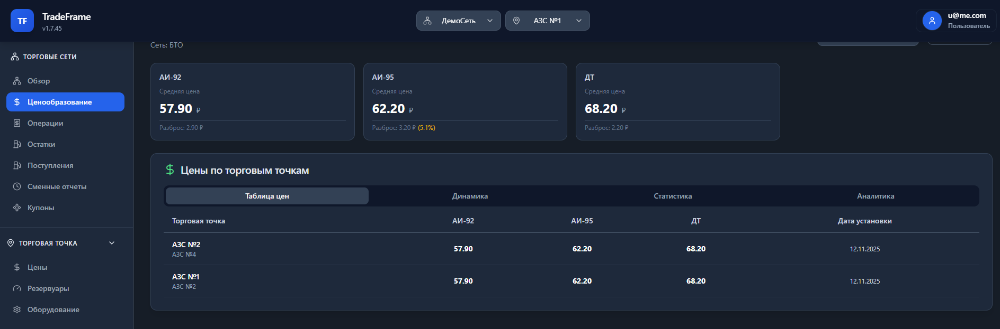
*Таблица цен по всем АЗС и типам топлива*

**Возможности:**

- Просмотр текущих и запланированных цен на всех станциях
- Быстрое изменение цены на одной АЗС, группе или всей сети
- Расписание автоматического изменения цен
- История изменения цен с графиками

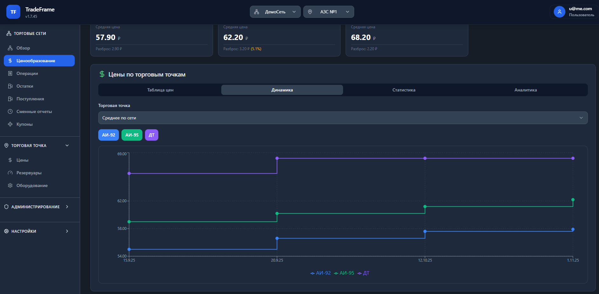

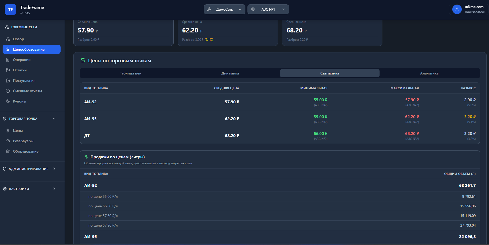

---

### 3.3 Операции и транзакции

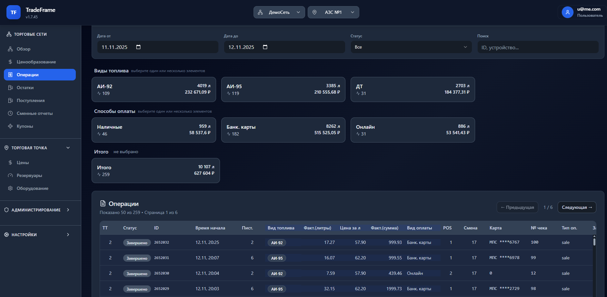
*Таблица транзакций в реальном времени с фильтрами*

**Данные каждой транзакции:**

- Точное время
- Объем в литрах
- Сумма платежа
- Способ оплаты (наличные, карта, топливная карта)
- Номер ТРК
- Оператор (если станция с обслуживанием)

**Фильтры:**

| Фильтр | Описание |
|--------|----------|
| По датам | Сегодня, вчера, последние 7 дней, произвольный период |
| По АЗС | Все станции, конкретная станция, группа |
| По типу топлива | АИ-92, АИ-95, АИ-98, ДТ |
| По способу оплаты | Наличные, карта, топливная карта, QR-код |
| По объему | Крупные (>100л), мелкие (<10л) |

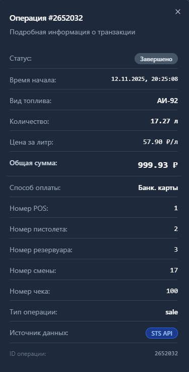

---

### 3.4 Контроль топлива

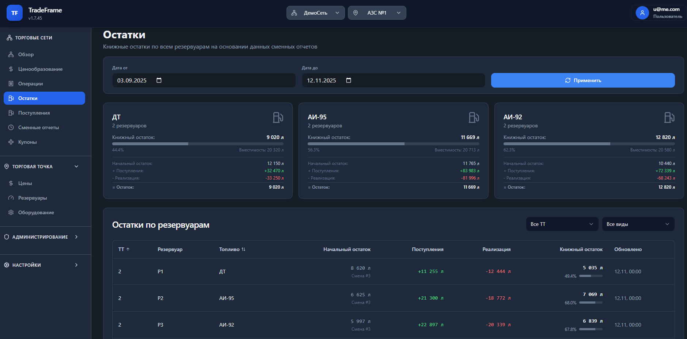
*Карточки резервуаров по сети с цветовой индикацией уровней*

**Цветовая индикация:**

- 🟢 **Норма (>30%)** — запаса хватит на несколько дней
- 🟡 **Внимание (10-30%)** — пора планировать поставку
- 🔴 **Критично (<10%)** — срочная поставка!

**Интеллектуальный учет:**

Система использует алгоритм автокалибровки, который анализирует:
- Реальные данные отпуска с ТРК
- Температуру и плотность топлива
- Историю поставок и отпусков

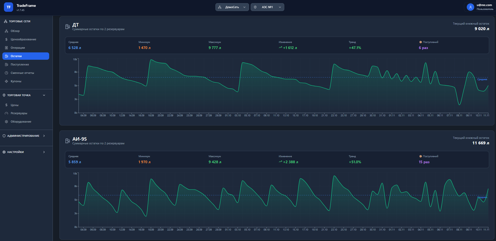

---

### 3.5 Поступления нефтепродуктов

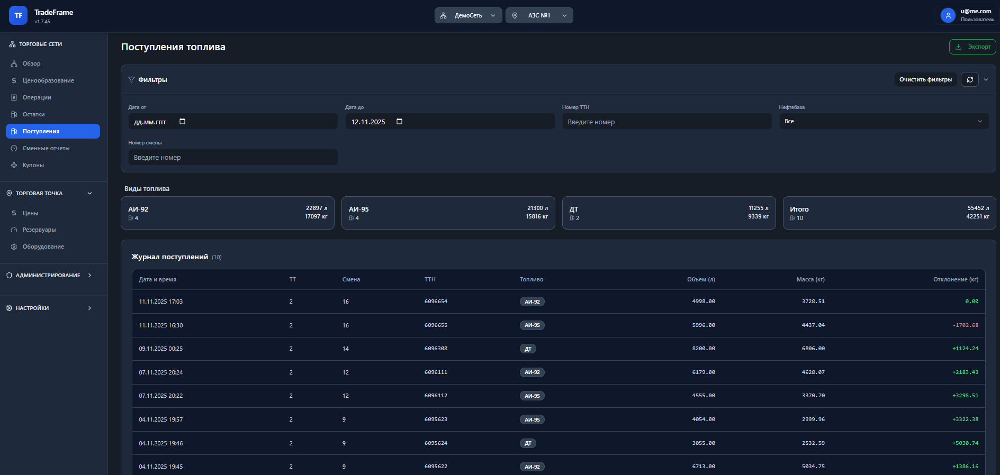
*Журнал поступлений с детализацией*

Каждая поставка фиксируется:
- Дата, время, поставщик
- Заявленный объём (по документам)
- Фактический объём (по датчикам с учётом температуры)
- Расхождение (если есть)

---

### 3.6 Купоны на остаток топлива

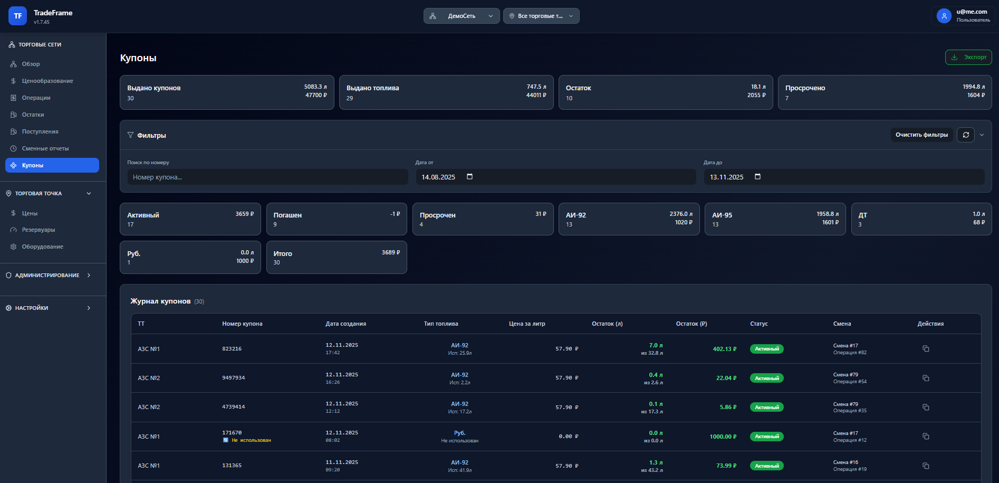
*Журнал выданных купонов на остаток топлива*

**Что такое купон?**

Купон — это способ вернуть клиенту неиспользованный остаток оплаты на терминале самообслуживания. Если клиент оплатил наличными, но топливо не поместилось в бак полностью, терминал не может выдать сдачу деньгами. Вместо этого печатается купон на остаток.

**Как это работает:**

| Этап | Описание |
|------|----------|
| 1. Оплата | Клиент вносит наличные (например, 1000 ₽) |
| 2. Заправка | Бак заполнился на 850 ₽, остаток 150 ₽ |
| 3. Купон | Терминал печатает купон на 150 ₽ |
| 4. Использование | Клиент заправляется по купону без оплаты |

**Условия использования:**
- Срок действия: **7 дней** с момента выдачи
- Место: только на **том же терминале**, где был выдан
- Оплата: не требуется, топливо по купону бесплатно (уже оплачено)

**Данные в журнале:**
- Номер купона
- Дата и время выдачи
- Сумма остатка
- Статус (активен / использован / просрочен)
- Дата использования (если был использован)

---

### 3.7 Сменные отчёты

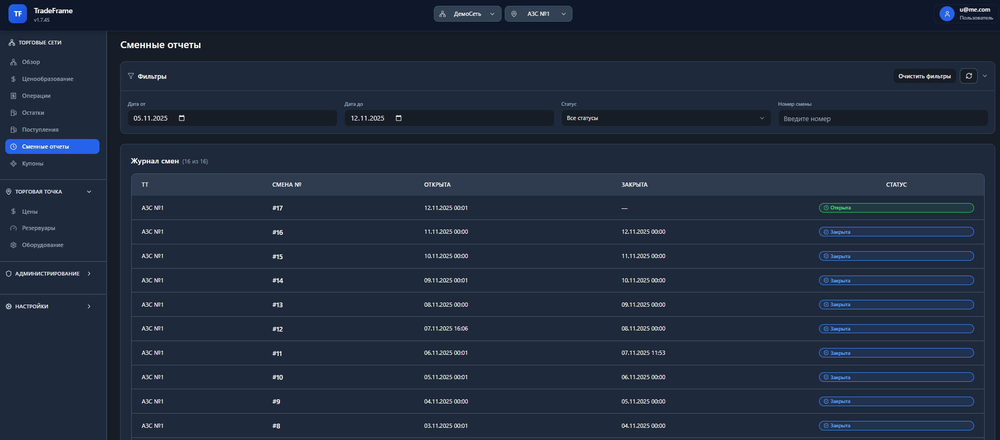
*Список смен с возможностью выбора для детального просмотра*

Сменный отчёт — ключевой документ для учёта работы АЗС за период смены. TradeFrame предоставляет полную детализацию по четырём разделам.

#### Состав смены

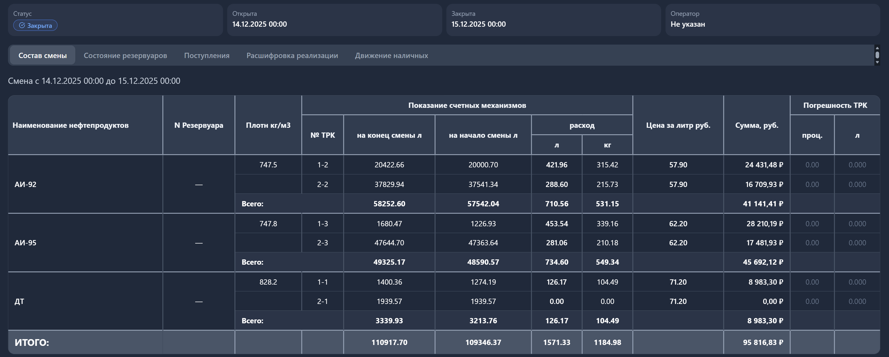
*Сводка реализации за смену с показаниями счётчиков*

**Что показывает:**

| Колонка | Описание |
|---------|----------|
| **Вид топлива** | АИ-92, АИ-95, АИ-98, ДТ, ДТз и др. |
| **ПСМ начало** | Показания суммарных счётчиков на начало смены |
| **ПСМ конец** | Показания суммарных счётчиков на конец смены |
| **По ПСМ** | Разница показаний = фактический отпуск |
| **Цена** | Действующая цена за литр |
| **Сумма** | Выручка по виду топлива |

**Итоговая строка** показывает общий объём отпуска и выручку за смену.

---

#### Расшифровка реализации

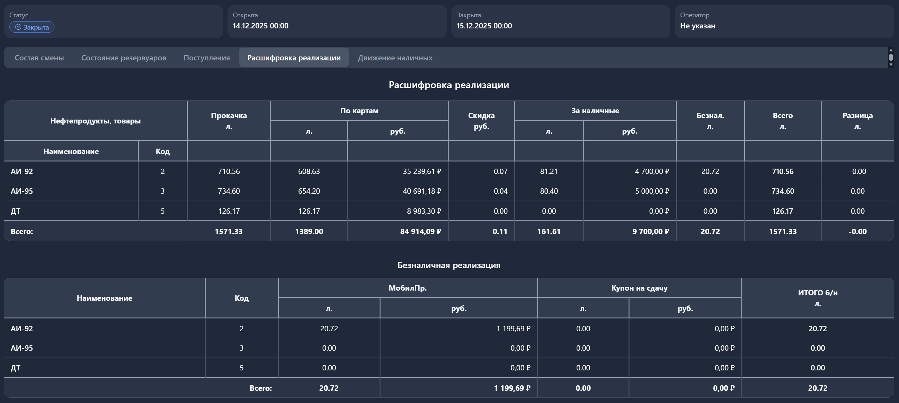
*Детализация продаж по способам оплаты*

**Способы оплаты:**

| Способ | Код | Описание |
|--------|-----|----------|
| **Наличные** | НЛ | Оплата купюрами и монетами |
| **Банковская карта** | БК | Оплата через POS-терминал |
| **Топливная карта** | ТК | Корпоративные топливные карты |
| **QR-код** | QR | Оплата через мобильное приложение |
| **Онлайн-заказ** | ОЗ | Предоплаченные заказы |
| **Корпоративная карта** | КР | Кредитные карты организаций |

**Детализация по каждому способу оплаты:**
- Объём в литрах
- Количество операций
- Сумма выручки

---

#### Состояние резервуаров

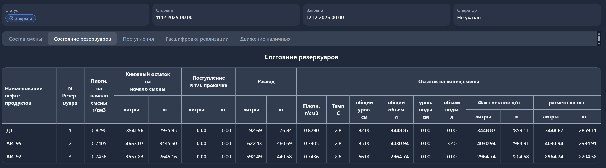
*Остатки топлива на начало и конец смены*

**Данные по каждому резервуару:**

| Параметр | На начало | На конец |
|----------|-----------|----------|
| **Уровень** | мм | мм |
| **Объём** | литры | литры |
| **Температура** | °C | °C |
| **Плотность** | кг/м³ | кг/м³ |
| **Масса** | кг | кг |

**Расчётные показатели:**
- **Отпущено** — разница объёмов (с учётом поступлений)
- **Расхождение** — разница между отпуском по ПСМ и по резервуарам

---

#### Поступления за смену

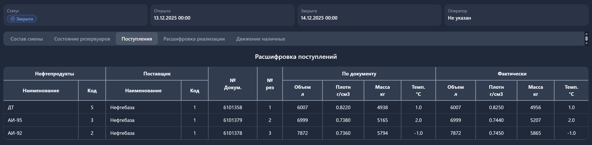
*Журнал поступлений нефтепродуктов за смену*

**Данные каждого поступления:**

| Поле | Описание |
|------|----------|
| **Дата и время** | Момент слива топлива |
| **Вид топлива** | АИ-92, ДТ и др. |
| **Резервуар** | Номер резервуара приёма |
| **По ТТН** | Объём по товарно-транспортной накладной |
| **По факту** | Объём по показаниям датчика уровня |
| **Расхождение** | Разница (недолив/перелив) |
| **Поставщик** | Наименование поставщика |
| **Номер ТТН** | Номер сопроводительного документа |

**Автоматический контроль:**
- Система сравнивает заявленный и фактический объём
- При расхождении >0.5% — автоматическое уведомление
- Все поступления сохраняются для сверки с бухгалтерией

---

## 4. Управление торговой точкой (АЗС)

### 4.1 Цены на АЗС

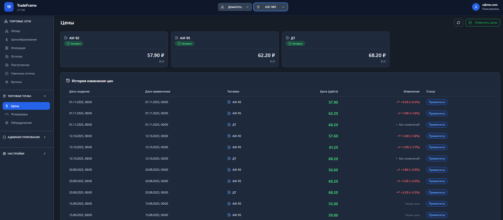
*Управление ценами конкретной АЗС*

- Просмотр и изменение цен конкретной станции
- Текущие и запланированные цены
- Синхронизация с POS-терминалами автоматически

---

### 4.2 Резервуары

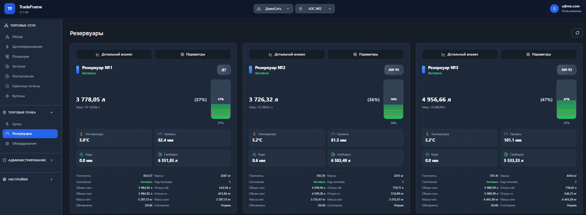
*Карточки резервуаров с анимацией уровня топлива*

**Информация о резервуаре:**

| Параметр | Описание |
|----------|----------|
| **Емкость** | Общий объем резервуара |
| **Остаток** | В литрах и процентах |
| **Температура** | Влияет на объем топлива |
| **Прогноз** | Время до опустошения |
| **Рекомендация** | Объем и дата поставки |

---

### 4.3 Оборудование

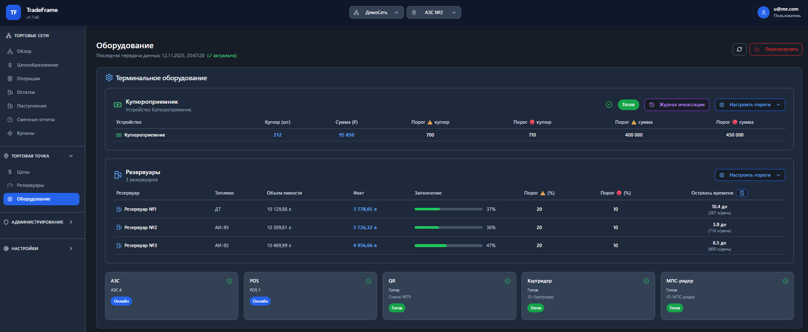
*Статусы всего оборудования АЗС*

**Контролируемое оборудование:**

| Оборудование | Контроль |
|--------------|----------|
| **ТРК** | Статус, счетчик отпуска |
| **Купюроприемники** | Уровень заполнения |
| **Платежные терминалы** | Статус, история транзакций |
| **Контроллеры** | Датчики уровня, температуры |

**Статусы:**
- 🟢 **Онлайн** — работает нормально
- 🔴 **Офлайн** — требуется проверка
- 🟡 **Предупреждение** — работает, но есть проблемы

---

## 5. Система уведомлений

### 5.1 Настройки уведомлений

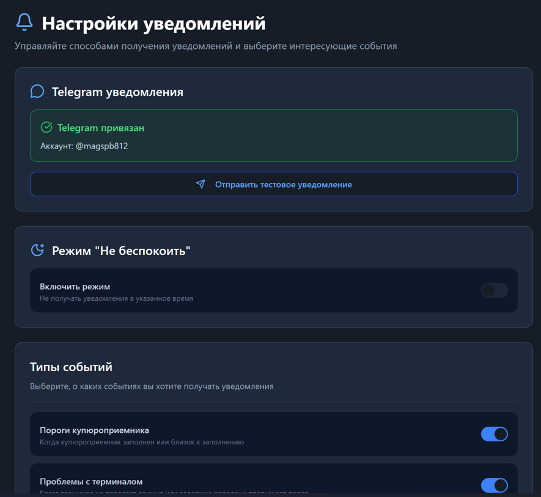
*Настройки Telegram, Email, режим "Не беспокоить"*

**Каналы уведомлений:**
- **Telegram Bot** (@TradeFrameDW_Bot) — мгновенные уведомления
- **Email** — для тех, кто предпочитает почту

**Автоматические проверки:**

| Проверка | Частота | Описание |
|----------|---------|----------|
| Критический уровень топлива | Каждые 4 часа | Резервуар <10% |
| Оборудование offline | Каждые 30 минут | ТРК, терминал не отвечает |
| Переполнение купюроприемника | Каждые 6 часов | Заполнение >85% |
| Незакрытые смены | Ежедневно в 01:00 | Смена не закрыта |

**Приоритеты:**
- 🔴 **Критичное** — немедленные действия
- 🟠 **Высокое** — важные события
- 🟡 **Среднее** — информационные
- 🔵 **Низкое** — общие уведомления

---

### 5.2 Рассылка сообщений (Broadcast)

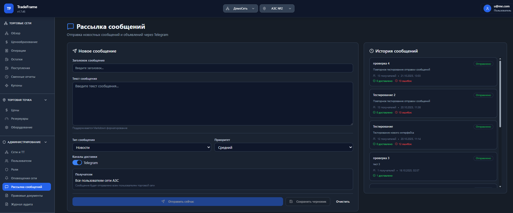
*Форма создания сообщения с выбором получателей*

**Возможности:**
- Массовая рассылка новостей и объявлений
- Выбор получателей: все, по ролям, конкретные пользователи
- Выбор каналов: Telegram, Email или оба
- Типы: новости, объявления, оповещения, ТО
- Статистика доставки

---

## 6. Администрирование

### 6.1 Управление сетями и АЗС

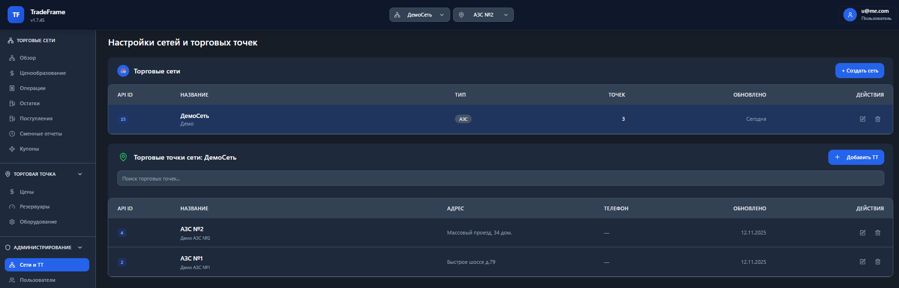
*Управление торговыми сетями и АЗС*

- Создание и редактирование торговых сетей
- Добавление и настройка станций
- Деактивация/активация точек
- Привязка оборудования

---

### 6.2 Управление пользователями

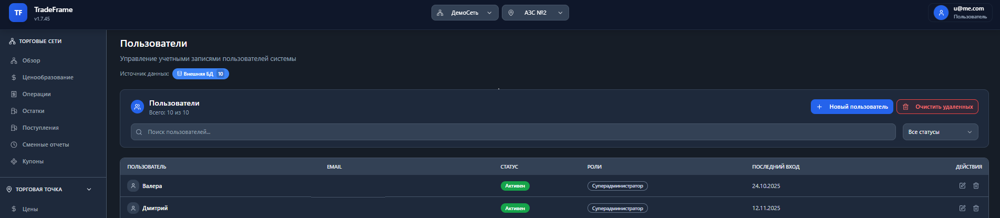
*Таблица пользователей с ролями*

**Операции:**
- Создание учетных записей
- Назначение ролей
- Привязка к сетям и АЗС
- Блокировка/разблокировка аккаунтов
- Смена паролей

---

### 6.3 Управление ролями

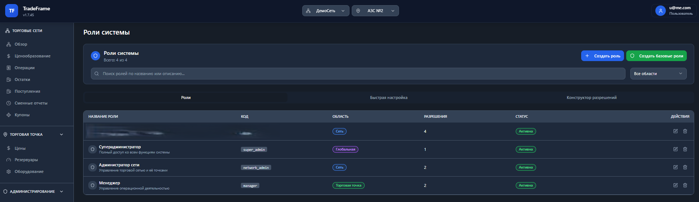
*Список ролей с матрицей прав доступа*

**Предустановленные роли:**

| Роль | Права |
|------|-------|
| **Администратор** | Полный доступ ко всему |
| **Менеджер сети** | Управление своими сетями, цены, остатки |
| **Менеджер АЗС** | Управление своими станциями |
| **Оператор** | Только своя станция, закрытие смены |
| **Аналитик** | Только просмотр отчетов |

---

### 6.4 Правовые документы и аудит

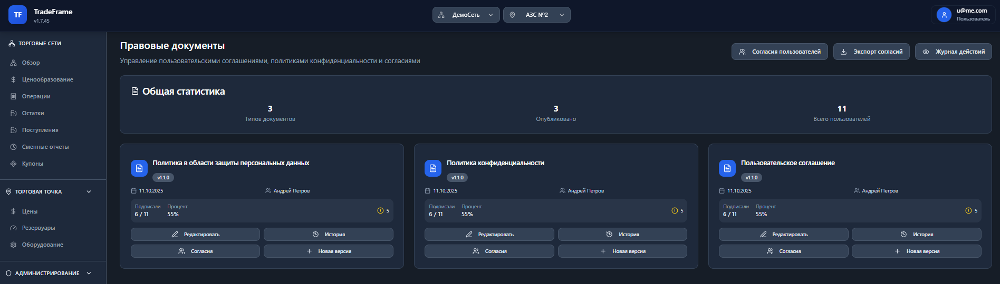
*Управление правовыми документами*

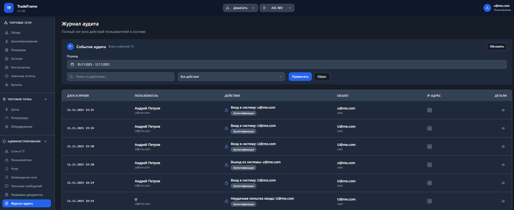
*Журнал аудита — кто, когда, что изменил*

**Журнал аудита фиксирует:**
- Кто совершил действие
- Когда (дата и время)
- Что изменил (старое → новое значение)
- IP-адрес и браузер

---

## 7. Мобильная версия (PWA)

TradeFrame Builder — это Progressive Web App (PWA), которое работает на любом устройстве.

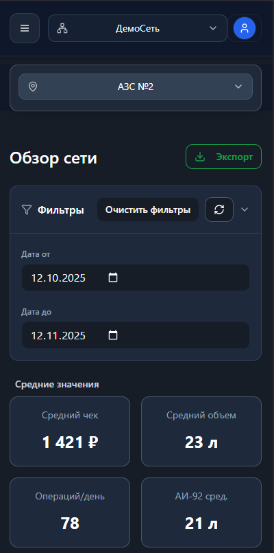
*Главный экран на смартфоне*

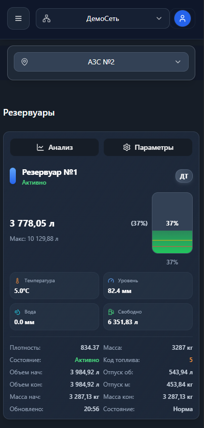
*Резервуары в вертикальной ориентации*

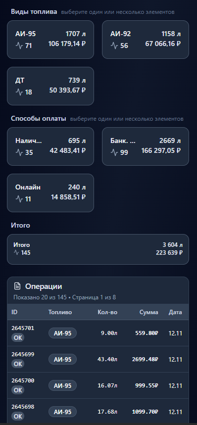
*Транзакции на мобильном экране*

### Преимущества PWA

| Преимущество | Описание |
|--------------|----------|
| **Установка без магазинов** | Не требует App Store или Google Play |
| **Мгновенные обновления** | Изменения доступны сразу |
| **Работа офлайн** | Кэширование данных |
| **Push-уведомления** | Как в обычном приложении |

### Установка на устройства

**Desktop (Chrome/Edge):**
- Иконка установки в адресной строке

**Android:**
- Chrome → Меню → "Добавить на главный экран"

**iOS:**
- Safari → Поделиться → "На экран Домой"

---

## Интеграции

### Поддерживаемые системы

| Система | Интеграция |
|---------|------------|
| **STS POS API** | Синхронизация транзакций, управление ценами и оборудованием |
| **1С** | Автоматическая выгрузка сменных отчетов |
| **Telegram Bot API** | Уведомления и коммуникация |
| **Email (SMTP)** | Дополнительный канал уведомлений |

---

## Безопасность

### Меры защиты

- **JWT токены** с ограниченным сроком действия (1 час)
- **Хеширование паролей** (SHA-256)
- **Ролевая модель доступа** (RBAC) — 40+ разрешений
- **Row Level Security** — изоляция данных на уровне БД
- **Журнал аудита** — логирование всех действий

### Соответствие стандартам

- ✅ 152-ФЗ "О персональных данных" (Россия)

---

## Контакты

**Общие вопросы:**
info@dataworker.ru

**Техподдержка:**
support@dataworker.ru
