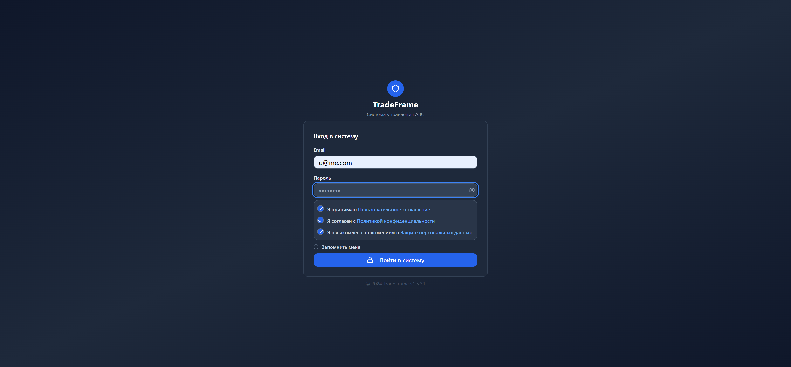
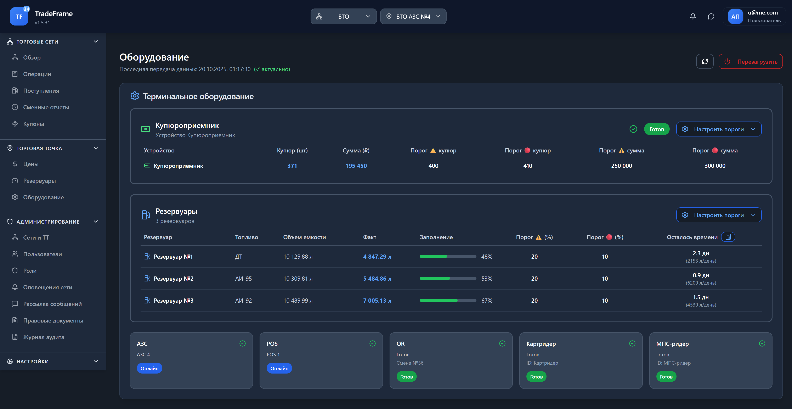
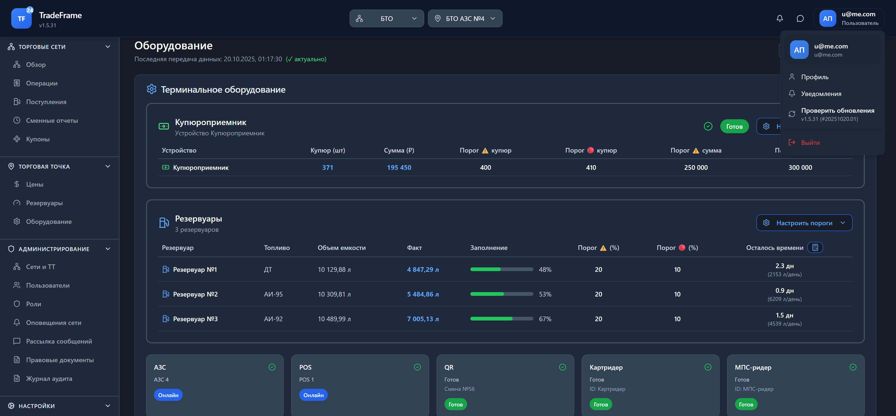
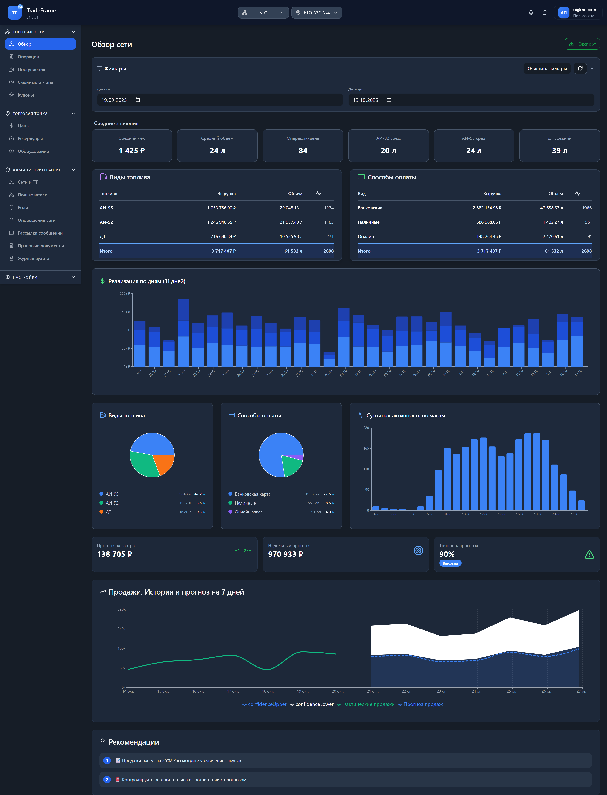
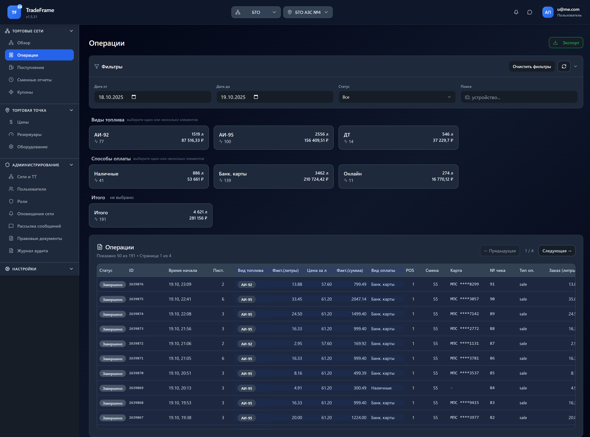
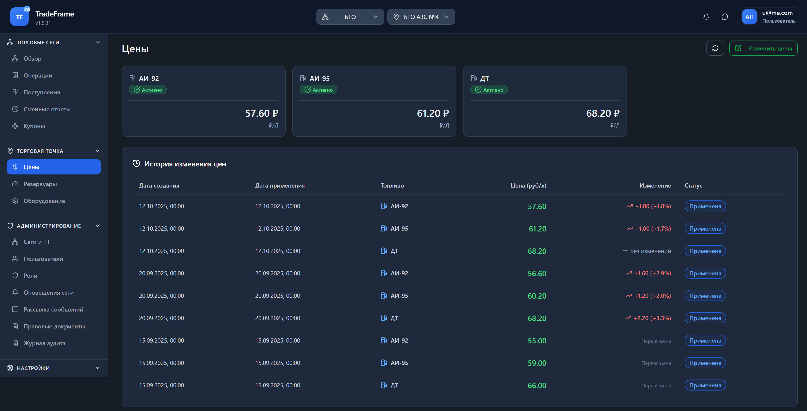
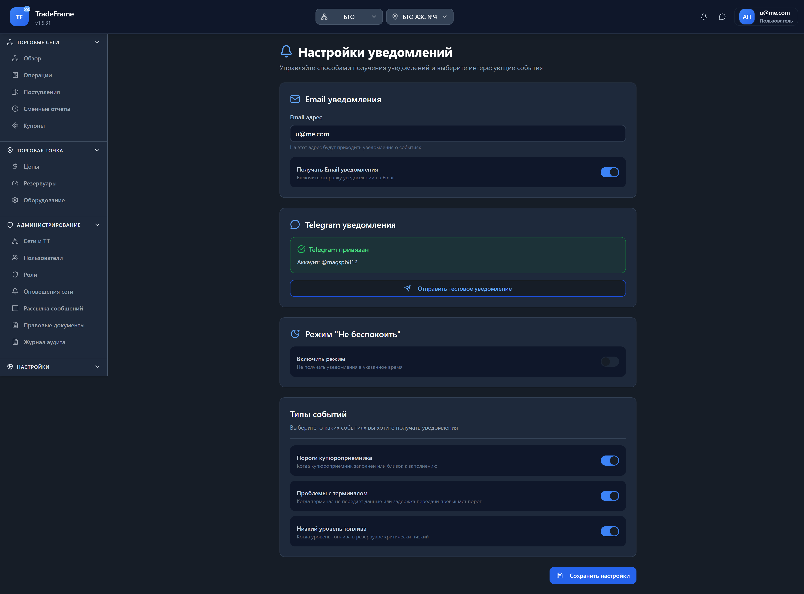
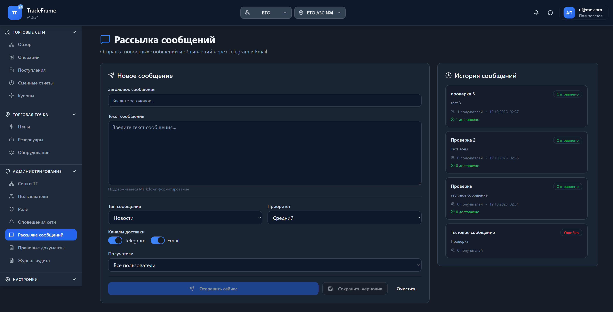

# Руководство пользователя TradeFrame Builder v1.5.31

**Платформа управления торговыми сетями АЗС**

---

## Содержание

1. [Введение](#введение)
2. [Начало работы](#начало-работы)
   - [Авторизация в системе](#авторизация-в-системе)
   - [Интерфейс приложения](#интерфейс-приложения)
3. [Торговые сети](#торговые-сети)
   - [Обзор сети](#обзор-сети)
   - [Операции и транзакции](#операции-и-транзакции)
4. [Торговая точка](#торговая-точка)
   - [Управление ценами](#управление-ценами)
   - [Мониторинг оборудования](#мониторинг-оборудования)
5. [Система уведомлений](#система-уведомлений)
   - [Настройка уведомлений](#настройка-уведомлений)
   - [Привязка Telegram](#привязка-telegram)
6. [Рассылка сообщений](#рассылка-сообщений)
7. [Часто задаваемые вопросы](#часто-задаваемые-вопросы)

---

## Введение

TradeFrame Builder — это современная веб-платформа для управления торговыми сетями АЗС. Система предоставляет:

- 📊 **Аналитику продаж** с графиками и прогнозами
- 💰 **Управление ценами** на топливо
- 🔔 **Систему уведомлений** через Telegram и Email
- 📱 **PWA поддержку** — работает как мобильное приложение
- 🛢️ **Мониторинг резервуаров** и оборудования
- 📨 **Рассылку сообщений** для пользователей

**Версия:** 1.5.31
**Дата обновления:** Октябрь 2025

---

## Начало работы

### Авторизация в системе

При первом входе в систему вы увидите страницу авторизации:

**Шаги для входа:**

1. **Введите Email** — ваш корпоративный адрес электронной почты
2. **Введите пароль** — пароль, выданный администратором
3. **Примите условия использования:**
   - ✅ Пользовательское соглашение
   - ✅ Политика конфиденциальности
   - ✅ Защита персональных данных
4. **Опционально:** Установите флажок "Запомнить меня" для автоматического входа
5. **Нажмите "Войти в систему"**

> **Примечание:** При первом входе рекомендуется сменить пароль в настройках профиля.

---

### Интерфейс приложения

После авторизации вы попадаете на главную страницу с информацией об оборудовании:

**Основные элементы интерфейса:**

1. **Шапка приложения** (верхняя панель):
   - Логотип и версия приложения (TF 24 v1.5.31)
   - Селектор торговой сети
   - Селектор торговой точки
   - Кнопка обновления данных
   - Уведомления
   - Меню пользователя

2. **Боковое меню** (навигация):
   - **ТОРГОВЫЕ СЕТИ** — Обзор, Операции, Поступления, Сменные отчеты, Купоны
   - **ТОРГОВАЯ ТОЧКА** — Цены, Резервуары, Оборудование
   - **АДМИНИСТРИРОВАНИЕ** — Сети и ТТ, Пользователи, Роли, Рассылка сообщений, Документы, Аудит
   - **НАСТРОЙКИ** — API CTC, Внешняя БД

3. **Рабочая область** — основной контент текущей страницы

**Меню пользователя:**

Нажмите на иконку пользователя в правом верхнем углу для доступа к:
- **Профиль** — настройки аккаунта
- **Уведомления** — настройка уведомлений
- **Проверить обновления** — проверка новых версий
- **Выйти** — выход из системы

---

## Торговые сети

### Обзор сети

Раздел "Обзор сети" предоставляет комплексную аналитику продаж:

**Основные блоки:**

#### 1. Фильтры и экспорт
- **Дата от / Дата до** — выбор периода анализа (по умолчанию последние 30 дней)
- **Кнопка "Экспорт"** — экспорт данных в Excel, CSV, PDF

#### 2. Средние значения
Ключевые метрики за выбранный период:
- **Средний чек** — средняя сумма покупки (₽)
- **Средний объем** — средний объем заправки (л)
- **Операций/день** — количество транзакций в день
- **АИ-92/АИ-95/ДТ средний** — средний объем по каждому виду топлива (л)

#### 3. Виды топлива
Таблица с детализацией по каждому типу топлива:
- Выручка (₽)
- Объем (л)
- Количество операций

**Круговая диаграмма** визуализирует распределение продаж по видам топлива.

#### 4. Способы оплаты
Анализ методов оплаты:
- **Банковские карты** — безналичная оплата
- **Наличные** — оплата наличными
- **Онлайн** — оплата через мобильное приложение

**Круговая диаграмма** показывает долю каждого способа оплаты.

#### 5. Реализация по дням
**График продаж** показывает выручку по дням за выбранный период. Позволяет:
- Выявить тренды
- Определить пиковые дни
- Планировать закупки

#### 6. Суточная активность по часам
**График активности** отображает распределение транзакций по часам суток:
- Помогает оптимизировать график работы
- Планировать загрузку персонала
- Анализировать пиковые часы

#### 7. Прогнозы продаж
Система автоматически рассчитывает прогнозы:
- **Прогноз на завтра** — ожидаемая выручка (+/- изменение)
- **Недельный прогноз** — прогноз на следующие 7 дней
- **Точность прогноза** — точность алгоритма (%)
- **График: История и прогноз** — визуализация фактических и прогнозируемых продаж

#### 8. Рекомендации
Система автоматически генерирует рекомендации на основе анализа данных:
- Оптимизация закупок
- Контроль остатков топлива
- Предупреждения о трендах

---

### Операции и транзакции

Раздел "Операции" содержит детальную информацию о всех транзакциях:

**Функционал раздела:**

#### 1. Фильтры
- **Дата от / Дата до** — фильтр по периоду (по умолчанию вчера-сегодня)
- **Статус** — фильтр по статусу операции (Все, Завершено, Отменено, В процессе)
- **Поиск** — поиск по ID операции, номеру карты, номеру чека

#### 2. Сводка по видам топлива
Карточки с агрегированными данными:
- **АИ-92, АИ-95, ДТ**:
  - Количество операций
  - Общий объем (л)
  - Общая сумма (₽)

#### 3. Сводка по способам оплаты
Группировка транзакций по методу оплаты:
- **Наличные** / **Банк. карты** / **Онлайн**
  - Количество операций
  - Объем (л)
  - Сумма (₽)

#### 4. Общий итог
- **Всего операций** за выбранный период
- **Общий объем** (л)
- **Общая выручка** (₽)

#### 5. Таблица операций
Детальная таблица с информацией по каждой транзакции:

**Колонки:**
- **Статус** — статус операции (Завершено, В процессе, Отменено)
- **ID** — уникальный идентификатор операции
- **Время начала** — дата и время транзакции
- **Пист.** — номер пистолета (колонки)
- **Вид топлива** — АИ-92, АИ-95, ДТ
- **Факт. (литры)** — фактически отпущенный объем
- **Цена за л** — цена за литр на момент операции
- **Факт. (сумма)** — общая стоимость
- **Вид оплаты** — способ оплаты
- **POS** — номер POS-терминала
- **Смена** — номер смены
- **Карта** — маскированный номер карты (для безнал. оплаты)
- **№ чека** — номер фискального чека
- **Тип оп.** — тип операции (sale, refund)
- **Заказ (литры)** — заказанный объем
- **Заказ (сумма)** — заказанная сумма

**Пагинация:**
- Отображается по 50 записей на страницу
- Навигация: ← Предыдущая / Следующая →
- Показано X из Y • Страница N из M

**Экспорт:**
- Кнопка "Экспорт" позволяет выгрузить данные в Excel, CSV, PDF

---

## Торговая точка

### Управление ценами

Раздел "Цены" предназначен для управления ценами на топливо:

**Функционал:**

#### 1. Текущие цены
Карточки с активными ценами для каждого вида топлива:
- **АИ-92** — 57.60 ₽/л
- **АИ-95** — 61.20 ₽/л
- **ДТ** — 68.20 ₽/л

**Статус:** Активно — цена применена и действует

**Действия:**
- Нажмите на **кнопку с ценой** для редактирования
- Кнопка **"Изменить цены"** для массового изменения

#### 2. История изменения цен
Таблица со всеми изменениями цен:

**Колонки:**
- **Дата создания** — когда было создано изменение
- **Дата применения** — когда цена вступила в силу
- **Топливо** — вид топлива
- **Цена (руб/л)** — новая цена
- **Изменение** — разница с предыдущей ценой (₽ и %)
- **Статус** — Применена / Запланирована / Отменена

**Примеры записей:**
- ✅ **12.10.2025** — АИ-92: 57.60 ₽ (+1.00 ₽, +1.8%) — Применена
- ✅ **12.10.2025** — АИ-95: 61.20 ₽ (+1.00 ₽, +1.7%) — Применена
- ✅ **12.10.2025** — ДТ: 68.20 ₽ (Без изменений) — Применена

**Как изменить цену:**

1. Нажмите на **кнопку с текущей ценой** (например, "57.60 ₽")
2. В открывшемся диалоге введите новую цену
3. Выберите дату и время применения:
   - **Немедленно** — цена применяется сразу
   - **Запланировать** — установить дату и время в будущем
4. Нажмите **"Сохранить"**
5. Система создаст запись в истории изменений
6. При наступлении времени применения цена автоматически обновится

> **Внимание:** Изменение цен требует роли Администратора или Менеджера.

---

### Мониторинг оборудования

Главная страница показывает состояние оборудования торговой точки:

**Блоки мониторинга:**

#### 1. Терминальное оборудование
Статус POS-терминала и подключенных устройств:
- **АЗС** — статус станции (Онлайн/Офлайн)
- **POS** — статус терминала (Онлайн/Офлайн)
- **QR** — статус QR-сканера (Готов/Неисправен)
- **Смена** — текущая смена (номер)
- **Картридер** — статус картридера (Готов/Неисправен)
- **МПС-ридер** — статус ридера платежных карт (Готов/Неисправен)

**Кнопка "Перезагрузить"** — удаленная перезагрузка терминала (требует подтверждения)

#### 2. Купюроприемник
Мониторинг заполнения купюроприемника:

**Информация:**
- **Устройство** — название устройства
- **Статус** — Готов / Внимание / Критично
- **Купюр (шт)** — количество купюр в кассете
- **Сумма (₽)** — общая сумма наличных
- **Пороги** — настраиваемые пороги предупреждений

**Пороги уведомлений:**
- **Порог ⚠️ купюр** — предупреждение (например, 400 шт)
- **Порог 🔴 купюр** — критический (например, 410 шт)
- **Порог ⚠️ сумма** — предупреждение (например, 250 000 ₽)
- **Порог 🔴 сумма** — критический (например, 300 000 ₽)

**Кнопка "Настроить пороги"** — изменение порогов для уведомлений

**Пример:**
- Купюроприемник: **371 купюр** / **195 450 ₽**
- Статус: **Готов** (ниже порога предупреждения)

#### 3. Резервуары
Таблица с информацией о резервуарах топлива:

**Колонки:**
- **Резервуар** — номер и название
- **Топливо** — тип топлива (АИ-92, АИ-95, ДТ)
- **Объем емкости** — максимальный объем (л)
- **Факт** — текущий уровень топлива (л)
- **Заполнение** — процент заполнения (%)
- **Порог ⚠️ (%)** — предупреждение о низком уровне
- **Порог 🔴 (%)** — критический уровень
- **Осталось времени** — прогноз на сколько хватит (дни)

**Пример:**

| Резервуар | Топливо | Объем | Факт | Заполнение | Порог ⚠️ | Порог 🔴 | Осталось |
|-----------|---------|-------|------|------------|---------|---------|----------|
| Резервуар №1 | ДТ | 10 129,88 л | 4 847,29 л | 48% | 20% | 10% | 2.3 дн (2153 л/день) |
| Резервуар №2 | АИ-95 | 10 309,81 л | 5 484,86 л | 53% | 20% | 10% | 0.9 дн (6209 л/день) |
| Резервуар №3 | АИ-92 | 10 489,99 л | 7 005,13 л | 67% | 20% | 10% | 1.5 дн (4539 л/день) |

**Расчет "Осталось времени":**
Система автоматически рассчитывает на сколько дней хватит топлива на основе:
- Текущего уровня
- Средней скорости расхода за последние 7 дней

**Цветовые индикаторы:**
- 🟢 **Норма** — выше порога ⚠️
- 🟡 **Внимание** — между порогами ⚠️ и 🔴
- 🔴 **Критично** — ниже порога 🔴

**Кнопка "Настроить пороги"** — изменение порогов для резервуаров

**Последняя передача данных:**
В верхней части страницы отображается время последнего обновления данных:
- **20.10.2025, 01:17:30 (✓ актуально)** — данные свежие
- **Кнопка обновления** — принудительный запрос актуальных данных

---

## Система уведомлений

### Настройка уведомлений

Раздел "Настройки уведомлений" позволяет настроить способы получения уведомлений:

**Доступные каналы уведомлений:**

#### 1. Email уведомления
- **Email адрес** — укажите адрес для получения уведомлений
- **Переключатель** — включить/выключить Email уведомления
- На указанный адрес будут приходить уведомления о событиях

**Пример настройки:**
- Email: u@me.com
- Статус: ✅ Включено

#### 2. Telegram уведомления
Получение уведомлений в Telegram через бота **@TradeFrameDW_Bot**

**Статусы:**
- ✅ **Telegram привязан** — аккаунт @magspb812 привязан
- ⚠️ **Telegram не привязан** — требуется привязка

**Кнопки:**
- **"Привязать Telegram"** — получить ссылку для привязки
- **"Отвязать Telegram"** — отключить Telegram уведомления
- **"Отправить тестовое уведомление"** — проверка работы

---

### Привязка Telegram

**Пошаговая инструкция:**

1. **Нажмите кнопку "Привязать Telegram"** в настройках уведомлений
2. Система сгенерирует уникальный 8-символьный код (например: `ABC12XYZ`)
3. Вы получите ссылку вида: `https://t.me/TradeFrameDW_Bot?start=ABC12XYZ`
4. **Нажмите на ссылку** или скопируйте ее в браузер
5. Telegram откроется с ботом **TradeFrame Notifications**
6. **Нажмите "START"** или отправьте `/start ABC12XYZ`
7. Бот проверит код и привяжет ваш Telegram аккаунт
8. Вы получите подтверждение: **"✅ Telegram успешно привязан!"**
9. В интерфейсе TradeFrame появится статус: **"Telegram привязан: @ваш_username"**

**Команды бота:**
- `/start CODE` — привязка аккаунта (CODE — 8-символьный код)
- `/help` — справка по использованию
- `/status` — проверка статуса привязки и подписок
- `/unlink` — отвязка Telegram аккаунта

**Срок действия кода:** 24 часа
**Примечание:** Один код можно использовать только один раз

---

#### 3. Режим "Не беспокоить"
Настройка времени, когда уведомления не должны приходить:

- **Включить режим** — переключатель ВКЛ/ВЫКЛ
- **Время начала** — например, 22:00
- **Время конца** — например, 08:00
- **Разрешить критические уведомления** — получать критические уведомления даже в режиме DND

**Пример:**
- Режим DND: ❌ Выключен
- Время: не настроено

---

#### 4. Типы событий
Выберите, о каких событиях вы хотите получать уведомления:

**Доступные типы:**

1. **Пороги купюроприемника** ✅
   - Когда купюроприемник заполнен или близок к заполнению
   - Уведомления при достижении порогов ⚠️ и 🔴

2. **Проблемы с терминалом** ✅
   - Когда терминал не передает данные
   - Когда задержка передачи превышает порог

3. **Низкий уровень топлива** ✅
   - Когда уровень топлива в резервуаре критически низкий
   - Уведомления при достижении порогов ⚠️ и 🔴

**Управление подписками:**
- ✅ **Включено** — переключатель зеленый, вы получаете уведомления
- ❌ **Выключено** — переключатель серый, уведомления не приходят

**Сохранение настроек:**
- Нажмите **"Сохранить настройки"** внизу страницы
- Изменения вступают в силу немедленно

---

## Рассылка сообщений

Раздел "Рассылка сообщений" предназначен для отправки новостей и объявлений пользователям:

**Доступ:** Только для ролей Администратор и Менеджер

**Функционал:**

#### 1. Новое сообщение
Форма создания и отправки сообщения:

**Поля формы:**
- **Заголовок сообщения** — краткий заголовок (обязательно)
- **Текст сообщения** — основной текст сообщения (обязательно)
  - Поддерживается **Markdown форматирование**:
    - `**жирный**` → **жирный**
    - `*курсив*` → *курсив*
    - `[ссылка](url)` → ссылка
    - `` `код` `` → `код`

**Настройки:**
- **Тип сообщения:**
  - 📰 Новости — новостные сообщения
  - 📢 Объявление — важные объявления
  - ⚠️ Оповещение — срочные оповещения
  - 🔧 Техническое обслуживание — информация о техработах

- **Приоритет:**
  - 🔵 Низкий — обычные сообщения
  - 🟡 Средний — стандартный приоритет
  - 🟠 Высокий — важные сообщения
  - 🔴 Критический — срочные сообщения

- **Каналы доставки:**
  - ☑️ Telegram — отправка через Telegram бота
  - ☑️ Email — отправка на Email

- **Получатели:**
  - Все пользователи — рассылка всем
  - По ролям — выбор конкретных ролей
  - Конкретные пользователи — выбор пользователей
  - По торговым точкам — фильтр по ТТ
  - По торговым сетям — фильтр по сетям

**Действия:**
- **"Отправить сейчас"** — немедленная отправка (активна только при заполненных полях)
- **"Сохранить черновик"** — сохранение для отправки позже
- **"Очистить"** — очистить форму

#### 2. История сообщений
Список отправленных сообщений с информацией:

**Пример записи:**
- **Заголовок:** проверка 3
- **Статус:** Отправлено ✅
- **Текст (превью):** тест 3
- **Получатели:** 1 получателей
- **Дата отправки:** 19.10.2025, 02:57
- **Статистика доставки:** 1 доставлено

**Возможные статусы:**
- ✅ **Отправлено** — сообщение успешно отправлено всем получателям
- ⏳ **В процессе** — отправка еще не завершена
- ❌ **Ошибка** — произошла ошибка при отправке
- 📝 **Черновик** — сообщение сохранено, но не отправлено

**Клик по сообщению** открывает детальную статистику:
- Список получателей
- Статус доставки для каждого канала
- Время доставки
- Ошибки (если были)

---

## Часто задаваемые вопросы

### Общие вопросы

**Q: Как сменить пароль?**
A: Нажмите на иконку пользователя → Профиль → Изменить пароль

**Q: Как переключиться между торговыми точками?**
A: Используйте селектор торговой точки в верхней панели приложения

**Q: Можно ли работать офлайн?**
A: Да, приложение поддерживает PWA и может кэшировать данные для офлайн работы

**Q: Как установить приложение на телефон?**
A: Откройте приложение в браузере → Меню браузера → "Добавить на главный экран"

---

### Уведомления

**Q: Не приходят уведомления в Telegram. Что делать?**
A:
1. Проверьте, что Telegram привязан в настройках
2. Убедитесь, что переключатель "Telegram уведомления" включен
3. Проверьте подписки на типы событий
4. Отправьте тестовое уведомление для проверки

**Q: Как отписаться от определенного типа уведомлений?**
A: Настройки → Уведомления → Типы событий → Выключите ненужные типы

**Q: Что делать, если код привязки Telegram истек?**
A: Нажмите "Привязать Telegram" повторно — система сгенерирует новый код

---

### Цены и операции

**Q: Кто может изменять цены?**
A: Только пользователи с ролями Администратор или Менеджер

**Q: Можно ли запланировать изменение цены на будущее?**
A: Да, при изменении цены выберите опцию "Запланировать" и укажите дату и время

**Q: Как экспортировать список операций?**
A: На странице "Операции" нажмите кнопку "Экспорт" и выберите формат (Excel, CSV, PDF)

---

### Мониторинг оборудования

**Q: Как часто обновляются данные об оборудовании?**
A: Данные обновляются автоматически каждые 5 минут. Можно обновить вручную кнопкой "Обновить"

**Q: Что делать, если оборудование показывает статус "Офлайн"?**
A:
1. Проверьте физическое подключение оборудования
2. Попробуйте перезагрузить терминал через кнопку "Перезагрузить"
3. Если проблема сохраняется, обратитесь в техподдержку

**Q: Как настроить пороги для купюроприемника?**
A: Страница "Оборудование" → Блок "Купюроприемник" → Кнопка "Настроить пороги"

---

### Рассылка сообщений

**Q: Кто может отправлять broadcast-сообщения?**
A: Только пользователи с ролями Администратор или Менеджер

**Q: Можно ли отменить отправленное сообщение?**
A: Нет, отправленные сообщения отменить нельзя. Используйте черновики для проверки перед отправкой

**Q: Как узнать, кто получил сообщение?**
A: Кликните на сообщение в "Истории сообщений" для просмотра статистики доставки

---

## Поддержка

**Техническая поддержка:**
📧 Email: support@tradeframe.com
📱 Telegram: @TradeFrameSupport
📞 Телефон: +7 (XXX) XXX-XX-XX

**Документация:**
🔗 [Документация для разработчиков](../CLAUDE.md)
🔗 [API документация](../API_INTEGRATION.md)
🔗 [Система уведомлений](../NOTIFICATION_SYSTEM.md)

---

**© 2024-2025 TradeFrame Builder v1.5.31**
Дата последнего обновления: Октябрь 2025
